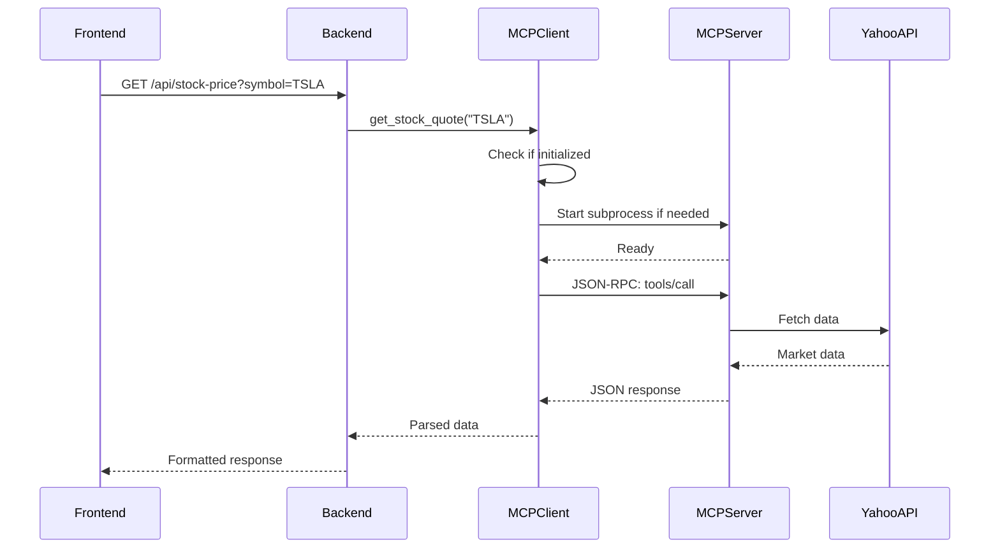

# MCP (Model Context Protocol) Architecture Documentation

## Complete MCP Server Setup and Architecture

### Overview
The GVSES AI Market Analysis Assistant uses a dual MCP server architecture to provide comprehensive market data through two specialized servers:
1. **market-mcp-server** (Node.js) - Yahoo Finance and CNBC integration
2. **alpaca-mcp-server** (Python) - Alpaca Markets professional data

## Architecture Components

### 1. MCP Communication Protocol
- **Protocol**: JSON-RPC 2.0 over stdio (stdin/stdout)
- **Transport**: Subprocess communication using pipes
- **Format**: Line-delimited JSON messages
- **Initialization**: MCP protocol version "2024-11-01"

### 2. Server Architecture

```
Backend FastAPI Server (mcp_server.py)
    ├── MCP Manager (mcp_manager.py)
    │   ├── market-mcp-server (Node.js subprocess)
    │   │   ├── Yahoo Finance API integration
    │   │   └── CNBC web scraping
    │   └── alpaca-mcp-server (Python subprocess)
    │       └── Alpaca Markets API
    └── MCP Client (mcp_client.py)
        └── JSON-RPC communication layer
```

### 3. Server Startup Process

#### Automatic Startup Flow:
1. **Backend Server Start**: `python3 mcp_server.py`
2. **Service Request**: When market data is requested (e.g., `/api/stock-price`)
3. **MCP Client Initialization**: 
   - `market_service.py` imports `get_mcp_client()`
   - Client checks if initialized
   - If not initialized, starts subprocess
4. **Subprocess Launch**:
   - Node.js: `node market-mcp-server/index.js`
   - Python: `python3 alpaca-mcp-server/server.py`
5. **Protocol Handshake**:
   - Send `initialize` request
   - Wait for response (120s timeout for first request)
   - Send `notifications/initialized`
6. **Ready State**: Server ready to handle tool calls

#### Manual Server Testing:
```bash
# Test market-mcp-server standalone
cd market-mcp-server
node index.js

# Test alpaca-mcp-server standalone  
cd alpaca-mcp-server
python3 server.py

# Both servers communicate via stdin/stdout JSON-RPC
```

### 4. MCP Client Implementation (`mcp_client.py`)

```python
class MCPClient:
    def __init__(self, server_path: str):
        self.server_path = Path(server_path)
        self.process = None  # Subprocess instance
        self.request_id = 0
        self.pending_requests = {}  # Futures for async responses
        
    async def start(self):
        # Launch subprocess with pipes
        self.process = await asyncio.create_subprocess_exec(
            'node',  # or 'python3'
            str(self.server_path),
            stdin=asyncio.subprocess.PIPE,
            stdout=asyncio.subprocess.PIPE,
            stderr=asyncio.subprocess.PIPE,
            cwd=self.server_path.parent
        )
        
    async def call_tool(self, tool_name: str, arguments: Dict):
        # Send JSON-RPC request
        request = {
            "jsonrpc": "2.0",
            "method": "tools/call",
            "params": {
                "name": tool_name,
                "arguments": arguments
            },
            "id": self._get_next_id()
        }
```

### 5. MCP Manager (`mcp_manager.py`)

The MCP Manager orchestrates multiple MCP servers:

```python
class MCPManager:
    def __init__(self):
        self.servers = {
            'market': NodeMCPClient('market-mcp-server/index.js'),
            'alpaca': PythonMCPClient('alpaca-mcp-server/server.py')
        }
    
    async def get_stock_data(self, symbol: str, source: str = "auto"):
        if source == "auto":
            # Try Alpaca first (professional data)
            # Fall back to Yahoo if needed
        elif source == "alpaca":
            # Use Alpaca exclusively
        elif source == "yahoo":
            # Use Yahoo exclusively
```

### 6. Available MCP Tools

#### market-mcp-server (35+ tools):
- **Stock Market**: get_stock_quote, get_stock_history, stream_stock_prices
- **Options**: get_options_chain
- **Crypto**: get_crypto_price, stream_crypto_prices
- **Analysis**: get_technical_indicators, get_analyst_ratings
- **News**: get_market_news (CNBC + Yahoo hybrid)
- **Market Overview**: get_market_overview, get_trending_stocks

#### alpaca-mcp-server (11+ tools):
- **Account**: get_account, get_positions, get_orders
- **Market Data**: get_stock_quote, get_stock_bars, get_stock_snapshot
- **Trading**: place_market_order, place_limit_order, cancel_order
- **Status**: get_market_status

### 7. Data Flow Example



### 8. Error Handling

- **Subprocess failures**: Automatic restart on next request
- **Timeout handling**: 120s for initialization, 90s for tool calls
- **Error propagation**: Errors returned in response for graceful handling
- **Logging**: All errors logged to stderr to avoid stdout pollution

### 9. Production Deployment

#### Fly.io Deployment:
- MCP servers are NOT included in Docker image
- Backend attempts to start MCP servers as subprocesses
- Current limitation: MCP servers fail with "No such file or directory"
- **Solution**: Deploy MCP servers as separate services or include in Docker build

#### Local Development:
- MCP servers start automatically when backend requests data
- Both servers run as child processes of the backend
- Logs visible in backend terminal (stderr)

### 10. Environment Variables

#### Backend (.env):
```bash
# MCP servers use these when started
ALPACA_API_KEY=your_key
ALPACA_SECRET_KEY=your_secret
ALPACA_BASE_URL=https://paper-api.alpaca.markets
```

#### market-mcp-server (optional):
```bash
# Optional API keys for enhanced features
ALPHAVANTAGE_API_KEY=your_key
FINNHUB_API_KEY=your_key
```

### 11. Testing MCP Servers

```python
# Test script (test_mcp.py)
import asyncio
from mcp_client import get_mcp_client

async def test():
    client = get_mcp_client()
    
    # This will auto-start the MCP server
    result = await client.call_tool("get_stock_quote", {
        "symbol": "TSLA"
    })
    
    print(f"Result: {result}")

asyncio.run(test())
```

### 12. Common Issues and Solutions

#### Issue: MCP server not starting
- **Check**: Node.js installed for market-mcp-server
- **Check**: Python 3 available for alpaca-mcp-server
- **Check**: Correct file paths in mcp_client.py

#### Issue: Timeout errors
- **Solution**: Increase timeout in mcp_client.py (line 132-133)
- **Note**: Yahoo Finance initial setup can be slow

#### Issue: No data returned
- **Check**: API keys configured in .env
- **Check**: Network connectivity
- **Check**: Symbol validity

### 13. Key Files

- **Backend Integration**:
  - `backend/mcp_client.py` - MCP client implementation
  - `backend/mcp_manager.py` - Dual server orchestration
  - `backend/services/market_service.py` - Market data service using MCP

- **MCP Servers**:
  - `market-mcp-server/index.js` - Yahoo/CNBC server
  - `alpaca-mcp-server/server.py` - Alpaca server
  
- **Configuration**:
  - `backend/.env` - API keys and configuration
  - `market-mcp-server/package.json` - Node dependencies
  - `alpaca-mcp-server/requirements.txt` - Python dependencies

### 14. Architecture Benefits

1. **Modular**: Separate servers for different data sources
2. **Scalable**: Can add more MCP servers easily
3. **Fault-tolerant**: Servers restart automatically on failure
4. **Protocol-based**: Standard JSON-RPC communication
5. **Language-agnostic**: Mix Node.js and Python servers
6. **Subprocess isolation**: Crashes don't affect main backend

### 15. Future Improvements

1. **Containerization**: Include MCP servers in Docker image
2. **Service mesh**: Deploy as separate microservices
3. **Caching layer**: Redis for frequently accessed data
4. **WebSocket streaming**: Real-time data push to frontend
5. **Load balancing**: Multiple MCP server instances

---

## Summary

The MCP architecture provides a robust, modular approach to integrating multiple data sources. The servers run as subprocesses, communicate via JSON-RPC over stdio, and are managed by the backend automatically. This design allows for easy addition of new data sources and maintains separation of concerns between data fetching and business logic.