# GVSES AI Market Analysis Assistant - Architecture

## System Overview

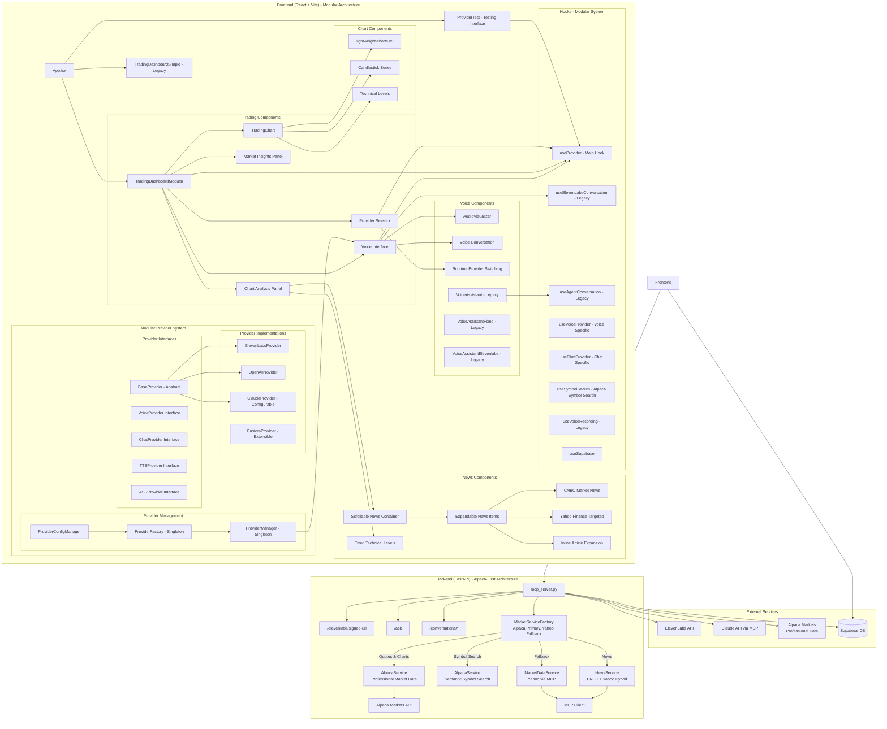

## Component Hierarchy

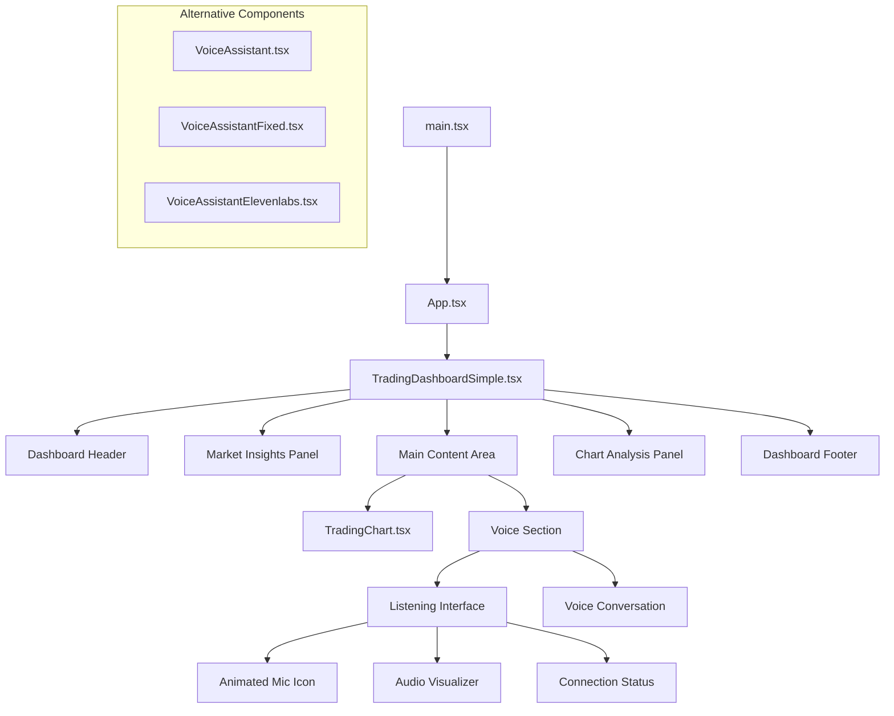

## Alpaca-First Data Architecture

```mermaid
graph TB
    subgraph "Data Source Priority"
        Request[Market Data Request] --> Router{Data Type?}
        
        Router -->|Stock Quotes| QuoteFlow[Quote Flow]
        Router -->|Chart Data| ChartFlow[Chart Flow]
        Router -->|News| NewsFlow[News Flow]
        
        QuoteFlow --> AlpacaQuote[1. Try Alpaca<br/>Professional Data]
        AlpacaQuote -->|Success| ReturnQuote[Return with<br/>"alpaca" source]
        AlpacaQuote -->|Fail| YahooQuote[2. Fallback to Yahoo<br/>via MCP]
        YahooQuote --> ReturnQuote2[Return with<br/>"yahoo_mcp" source]
        
        ChartFlow --> AlpacaChart[1. Try Alpaca<br/>Professional Bars]
        AlpacaChart -->|Success| ReturnChart[Return with<br/>"alpaca" source]
        AlpacaChart -->|Fail| YahooChart[2. Fallback to Yahoo<br/>via MCP]
        YahooChart --> ReturnChart2[Return with<br/>"yahoo_mcp" source]
        
        NewsFlow --> CNBCNews[CNBC via MCP<br/>+ Yahoo Supplement]
        CNBCNews --> ReturnNews[Return hybrid<br/>"mcp" source]
    end
    
    style AlpacaQuote fill:#81C784
    style AlpacaChart fill:#81C784
    style YahooQuote fill:#FFB74D
    style YahooChart fill:#FFB74D
    style CNBCNews fill:#90CAF9
```

## Data Flow - Alpaca-First Architecture

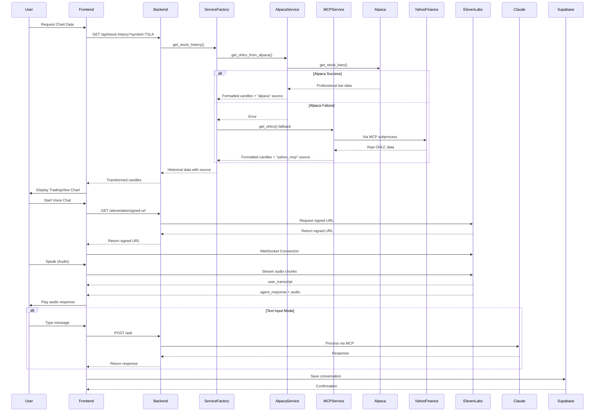

## File Structure

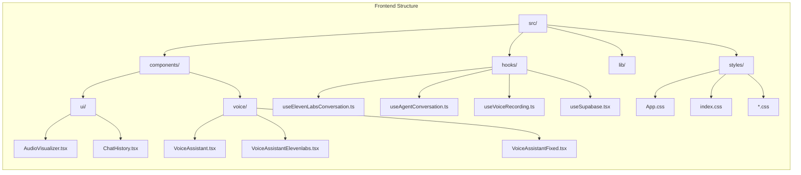

## WebSocket Communication Flow

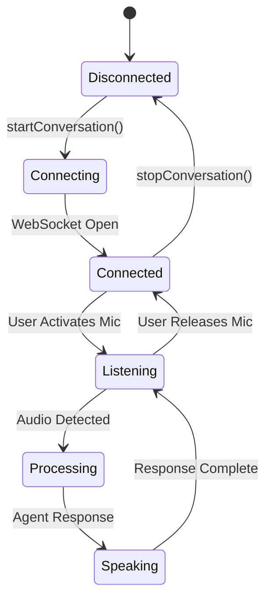

## API Endpoints

```mermaid
graph TD
    subgraph "Backend API Routes"
        Health[GET /health]
        SignedURL[GET /elevenlabs/signed-url]
        Ask[POST /ask]
        StockPrice[GET /api/stock-price - Alpaca → Yahoo Fallback]
        StockHistory[GET /api/stock-history - Alpaca → Yahoo Fallback]
        StockNews[GET /api/stock-news - CNBC + Yahoo Hybrid via MCP]
        ComprehensiveData[GET /api/comprehensive-stock-data - MCP Only]
        AnalystRatings[GET /api/analyst-ratings - MCP Only]
        MarketMovers[GET /api/market-movers - MCP Only]
        MarketOverview[GET /api/market-overview - MCP Only]
        SymbolSearch[GET /api/symbol-search - Alpaca Semantic Search]
        
        subgraph "Alpaca API Routes"
            AlpacaAccount[GET /api/alpaca/account]
            AlpacaQuote[GET /api/alpaca/quote/{symbol}]
            AlpacaSnapshot[GET /api/alpaca/snapshot/{symbol}]
            AlpacaBars[GET /api/alpaca/bars/{symbol}]
            AlpacaPositions[GET /api/alpaca/positions]
            AlpacaOrders[GET /api/alpaca/orders]
            AlpacaMarketStatus[GET /api/alpaca/market-status]
            AlpacaStockPrice[GET /api/alpaca/stock-price]
            AlpacaSymbolSearch[GET /api/symbol-search]
        end
        
        subgraph "Enhanced API Routes - Dual MCP"
            EnhancedMarketData[GET /api/enhanced/market-data<br/>Auto-selects best source]
            EnhancedHistorical[GET /api/enhanced/historical-data<br/>Intelligent data routing]
            EnhancedAccount[GET /api/enhanced/alpaca-account<br/>Direct Alpaca access]
            EnhancedPositions[GET /api/enhanced/alpaca-positions<br/>Portfolio positions]
            EnhancedOrders[GET /api/enhanced/alpaca-orders<br/>Order management]
            EnhancedStatus[GET /api/enhanced/market-status<br/>Market hours]
            EnhancedCompare[GET /api/enhanced/compare-sources<br/>Debug data sources]
        end
    end
    
    subgraph "Request Flow"
        SignedURL --> ElevenLabsAPI[ElevenLabs API]
        Ask --> ClaudeAPI[Claude via MCP]
        StockPrice --> MCPClient[MCP Client - Python]
        StockHistory --> MCPClient
        ComprehensiveData --> MCPClient
        StockNews --> NewsService[News Service - Hybrid]
        AnalystRatings --> MCPClient
        MarketMovers --> MCPClient
        MarketOverview --> MCPClient
        SymbolSearch --> AlpacaService[Alpaca Service - Python]
        MCPClient --> MCPServer[Market MCP Server - Node.js]
        
        AlpacaAccount --> AlpacaService[Alpaca Service - Python]
        AlpacaQuote --> AlpacaService
        AlpacaSnapshot --> AlpacaService
        AlpacaBars --> AlpacaService
        AlpacaPositions --> AlpacaService
        AlpacaOrders --> AlpacaService
        AlpacaMarketStatus --> AlpacaService
        AlpacaStockPrice --> AlpacaService
        
        EnhancedMarketData --> MCPManager[MCP Manager]
        EnhancedHistorical --> MCPManager
        EnhancedAccount --> MCPManager
        EnhancedPositions --> MCPManager
        EnhancedOrders --> MCPManager
        EnhancedStatus --> MCPManager
        EnhancedCompare --> MCPManager
        MCPManager --> MarketMCP[market-mcp-server]
        MCPManager --> AlpacaMCP[alpaca-mcp-server]
    end
    
    subgraph "MCP Tools & Data Sources"
        MCPServer --> YahooFinance[Yahoo Finance API v8]
        MCPServer --> CNBCIntegration[CNBC Web Scraping]
        MCPServer --> TechnicalIndicators[TA Library]
        MarketMCP --> YahooFinance
        MarketMCP --> CNBCIntegration
        YahooFinance --> HistoricalData[Historical OHLC Data]
        YahooFinance --> RealtimeQuotes[Real-time Stock Quotes]
        YahooFinance --> MarketData[Market Overview Data]
        CNBCIntegration --> NewsArticles[Professional Journalism]
        CNBCIntegration --> PreMarket[Pre-market Movers]
        CNBCIntegration --> MarketSentiment[Expert Analysis]
    end
    
    subgraph "Alpaca Markets Integration"
        AlpacaService --> AlpacaAPI[Alpaca Markets API]
        AlpacaMCP --> AlpacaAPI
        AlpacaAPI --> PaperTrading[Paper Trading Account]
        AlpacaAPI --> RealTimeData[Real-time Market Data]
        AlpacaAPI --> HistoricalBars[Historical Bars]
        AlpacaAPI --> AccountInfo[Account & Positions]
        AlpacaAPI --> OrderManagement[Order Management]
    end
    
    subgraph "News Service Hybrid System"
        NewsService --> CNBCPrimary[CNBC Market News via MCP]
        NewsService --> YahooSupplement[Yahoo Finance Symbol-Specific]
        NewsService --> NewsFiltering[Symbol Relevance Filter]
        NewsFiltering --> FinalNews[Merged News Feed]
    end
```

## News Service Architecture

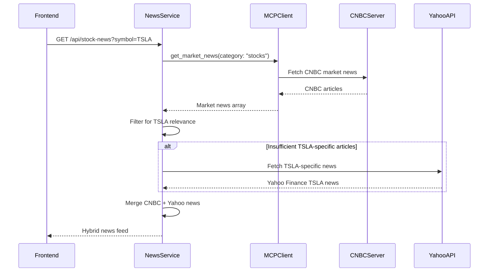

## Historical Data Pipeline (Fixed Aug 25, 2025)

```mermaid
graph LR
    subgraph "Frontend"
        TradingChart[TradingChart.tsx]
        TradingChart -->|fetchChartData()| MarketDataService[marketDataService.ts]
        MarketDataService -->|GET /api/stock-history| Axios[Axios HTTP Client]
    end
    
    subgraph "Backend"
        FastAPI[mcp_server.py]
        FastAPI -->|mcp_get_stock_history()| MCPClient[mcp_client.py]
        MCPClient -->|JSON-RPC over stdio| Subprocess[Node.js Subprocess]
    end
    
    subgraph "Market MCP Server"
        IndexJS[index.js]
        IndexJS -->|tools/call| StockHistory[get_stock_history tool]
        StockHistory -->|HTTP GET| YahooAPI[Yahoo Finance v8 API]
    end
    
    subgraph "Data Transformation"
        YahooAPI -->|Raw ISO timestamps| MCPServer[MCP Server formats]
        MCPServer -->|data array| Backend[Backend transforms]
        Backend -->|candles array| Frontend[Frontend displays]
    end
    
    style TradingChart fill:#90EE90
    style FastAPI fill:#87CEEB
    style IndexJS fill:#FFE4B5
    style YahooAPI fill:#FFA07A
```

## Market Data Integration (MCP)

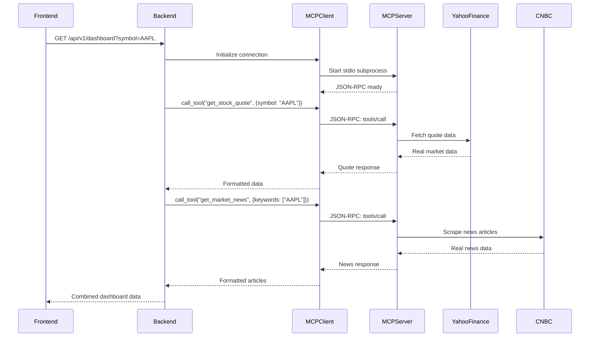

## Real-Time WebSocket Streaming

```mermaid
graph LR
    subgraph "WebSocket Architecture"
        Client[Browser Client]
        WSEndpoint[/ws/quotes]
        QuoteService[get_quote()]
        MCPClient[MCP Client]
        MCPServer[Market MCP Server]
        
        Client -->|WebSocket| WSEndpoint
        WSEndpoint -->|Poll 2s| QuoteService
        QuoteService --> MCPClient
        MCPClient -->|JSON-RPC| MCPServer
        MCPServer -->|Real Data| MCPClient
        MCPClient --> QuoteService
        QuoteService --> WSEndpoint
        WSEndpoint -->|Stream| Client
    end
```

## Voice Processing Pipeline

```mermaid
graph LR
    subgraph "Audio Input"
        Microphone[Microphone] --> MediaStream[MediaStream API]
        MediaStream --> AudioContext[AudioContext]
        AudioContext --> PCM[PCM Audio Chunks]
    end
    
    subgraph "Processing"
        PCM --> WebSocket[WebSocket to ElevenLabs]
        WebSocket --> ASR[Speech Recognition]
        ASR --> LLM[LLM Processing]
        LLM --> TTS[Text-to-Speech]
    end
    
    subgraph "Audio Output"
        TTS --> AudioQueue[Audio Queue]
        AudioQueue --> AudioElement[Audio Element]
        AudioElement --> Speaker[Speaker]
    end
```

## State Management

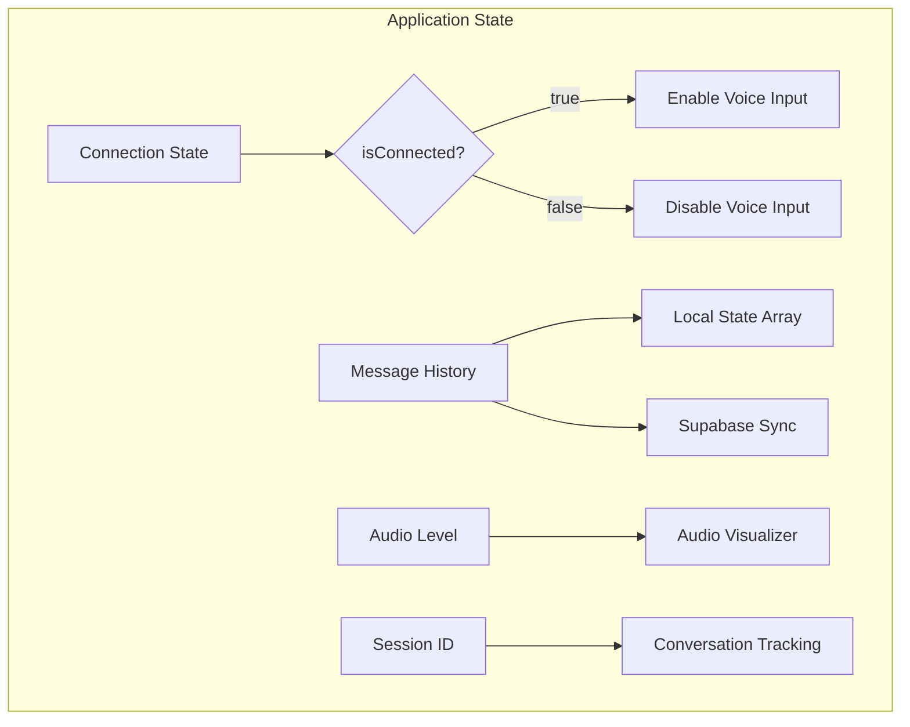

## Three-Pillar Data Architecture

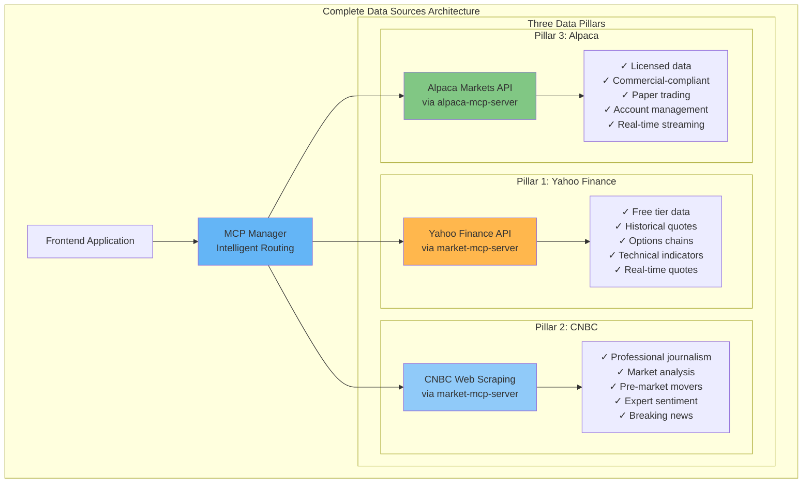

## Dual MCP Server Architecture

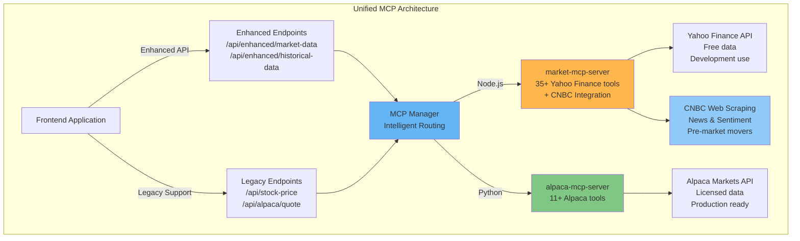

## Comprehensive Data Flow

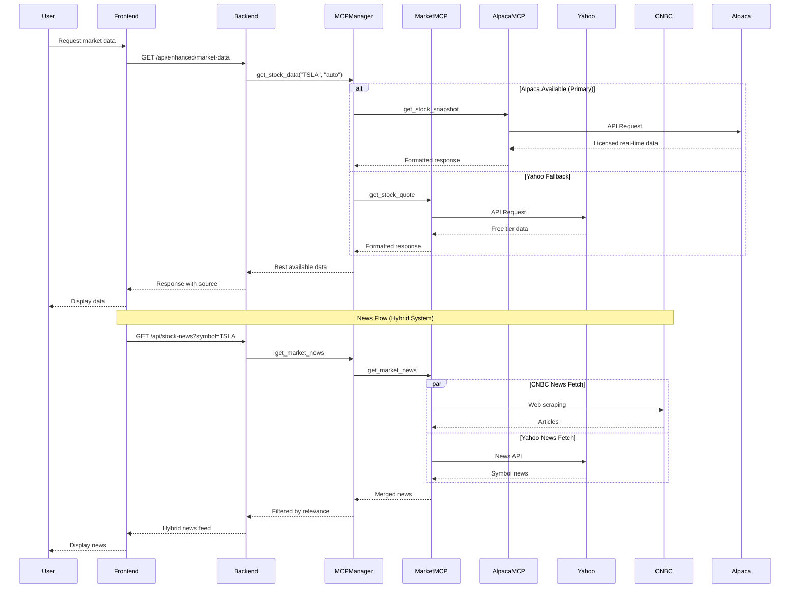

## Current Architecture Evolution

### Current Production: Alpaca-First with MCP Fallback (Commit e009f62 - Sep 2, 2025)

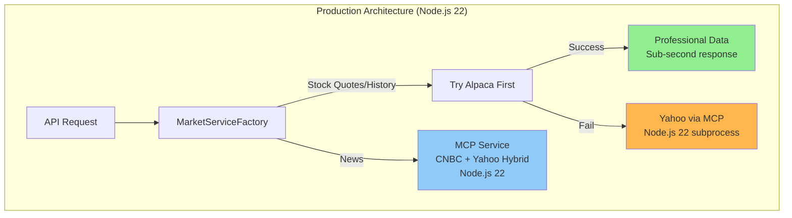

### Phase 2: Triple Hybrid Architecture (Production - Commit b152f15)

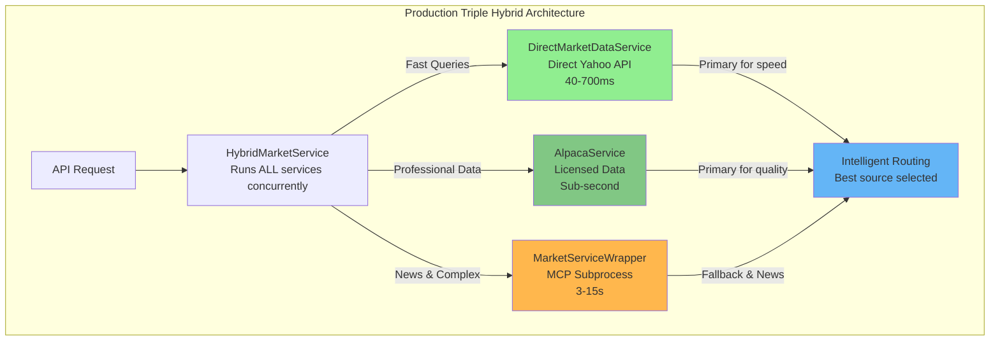

## Performance Metrics Comparison

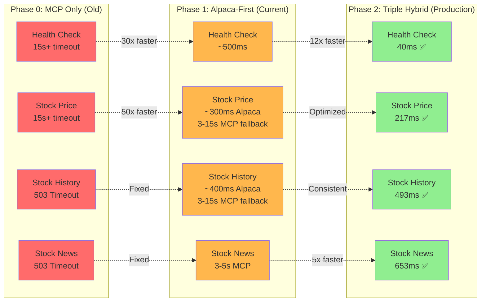

## Technology Stack

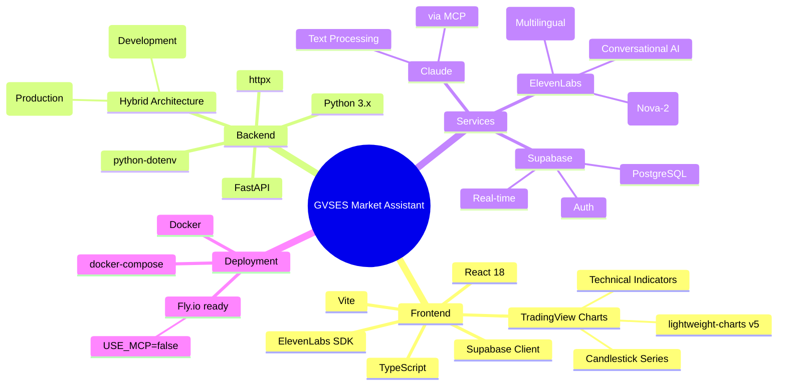

## Error Handling Flow

```mermaid
graph TD
    Start[User Action] --> Try{Try Operation}
    Try -->|Success| Complete[Operation Complete]
    Try -->|WebSocket Error| WSReconnect[Reconnect WebSocket]
    Try -->|API Error| APIRetry[Retry with Backoff]
    Try -->|Auth Error| AuthRefresh[Refresh Auth]
    
    WSReconnect -->|Success| Complete
    WSReconnect -->|Fail| Fallback[Text Mode Fallback]
    
    APIRetry -->|Success| Complete
    APIRetry -->|Fail| ErrorDisplay[Display Error]
    
    AuthRefresh -->|Success| Retry[Retry Operation]
    AuthRefresh -->|Fail| LoginPrompt[Prompt Login]
    
    Fallback --> Complete
    ErrorDisplay --> End[End]
    LoginPrompt --> End
    Retry --> Complete
```

## Database Schema

```mermaid
erDiagram
    SESSIONS ||--o{ CONVERSATIONS : contains
    CONVERSATIONS ||--o| AUDIO_FILES : may_have
    
    SESSIONS {
        uuid id PK
        timestamp created_at
        jsonb metadata
    }
    
    CONVERSATIONS {
        uuid id PK
        uuid session_id FK
        text role
        text content
        timestamp created_at
        jsonb metadata
    }
    
    AUDIO_FILES {
        uuid id PK
        uuid conversation_id FK
        text file_path
        text file_type
        timestamp created_at
    }
```

---

## Trading Dashboard Architecture

```mermaid
graph LR
    subgraph "Dashboard Layout"
        Header[Header<br/>GVSES Brand + Tabs]
        
        subgraph "Three Panel Layout"
            LeftPanel[Market Insights<br/>240px width]
            CenterPanel[Interactive Charts<br/>+ Voice Assistant<br/>Flexible width]
            RightPanel[Chart Analysis<br/>300px width]
        end
        
        Footer[Footer<br/>Tab Navigation]
    end
    
    Header --> LeftPanel
    Header --> CenterPanel
    Header --> RightPanel
    LeftPanel --> Footer
    CenterPanel --> Footer
    RightPanel --> Footer
```

## Trading Dashboard State Flow

```mermaid
stateDiagram-v2
    [*] --> Idle
    Idle --> ChartsTab: Select Charts Tab
    Idle --> VoiceTab: Select Voice Tab
    
    ChartsTab --> DisplayChart: Show Trading Chart
    VoiceTab --> DisplayChart: Show Trading Chart
    
    DisplayChart --> Listening: Click Mic/Listen Button
    Listening --> Recording: Start Recording
    Recording --> Processing: Stop Recording
    Processing --> DisplayResponse: Show AI Response
    DisplayResponse --> Listening: Continue
    
    Listening --> Idle: Cancel
    Recording --> Idle: Cancel
```

## Market Data Components

```mermaid
graph TD
    subgraph "Market Insights Panel - Dynamic Watchlist"
        SearchInput[Add Symbol Input]
        SearchInput --> AddButton[Add Button]
        AddButton --> Validation[Symbol Validation]
        Validation --> WatchlistUpdate[Update Watchlist]
        
        StockCard[Stock Card]
        StockCard --> Symbol[Stock Symbol]
        StockCard --> Price[Current Price]
        StockCard --> Change[Price Change %]
        StockCard --> Label[Technical Label<br/>ST/LTB/QE]
        StockCard --> Description[Momentum Description]
        StockCard --> RemoveButton[× Remove Button]
        
        LocalStorage[LocalStorage Persistence]
        WatchlistUpdate --> LocalStorage
        LocalStorage --> DefaultWatchlist[Default: TSLA, AAPL, NVDA, SPY, PLTR]
    end
    
    subgraph "Chart Analysis Panel - Scrollable"
        NewsSection[News Section - Expandable Items]
        NewsSection --> NewsItem[Clickable News Item]
        NewsItem --> NewsHeader[Header: Symbol + Time]
        NewsItem --> NewsTitle[Title + Source Badge]
        NewsItem --> ExpandIcon[▶/▼ Expand Icon]
        NewsItem --> ExpandedContent[Expanded: Description + Link]
        
        TechnicalLevels[Technical Levels]
        TechnicalLevels --> QELevel[QE Level + Price]
        TechnicalLevels --> STLevel[ST Level + Price]
        TechnicalLevels --> LTBLevel[LTB Level + Price]
        
        PatternDetection[Pattern Detection]
        PatternDetection --> PatternName[Pattern Name]
        PatternDetection --> Confidence[Confidence %]
    end
```

## Voice Interface Components

```mermaid
graph TD
    subgraph "Voice Assistant Interface"
        ListeningUI[Listening Interface]
        ListeningUI --> MicButton[Animated Mic Button<br/>with Pulse Rings]
        ListeningUI --> StatusText[AI Analysis/Listening]
        ListeningUI --> Timer[Recording Timer]
        ListeningUI --> Visualizer[Audio Visualizer Bars]
        ListeningUI --> Connection[Connection Status]
        
        ConversationUI[Voice Conversation]
        ConversationUI --> Messages[Message History]
        ConversationUI --> ControlChart[Control the Chart Button]
        ConversationUI --> Commands[Voice Commands Text]
        
        Messages --> UserMsg[User Message + Icon]
        Messages --> AssistantMsg[Assistant Message + Icon]
    end
```

## MCP Tools Overview

### market-mcp-server Tools (Yahoo Finance & CNBC)

#### Yahoo Finance Tools:
- **Stock Market**: get_stock_quote, get_stock_history, stream_stock_prices, get_options_chain, get_stock_fundamentals, get_earnings_calendar
- **Crypto**: get_crypto_price, get_crypto_market_data, stream_crypto_prices, get_defi_data, get_nft_collection
- **Analysis**: get_technical_indicators, get_analyst_ratings, get_insider_trading, get_institutional_holdings
- **Market Overview**: get_market_overview, get_trending_stocks, get_sector_performance, get_economic_calendar
- **Forex**: get_forex_rate, get_forex_history, stream_forex_rates
- **Commodities**: get_commodity_price, get_commodity_history, stream_commodity_prices

#### CNBC Integration Tools:
- **News & Analysis**: get_market_news (hybrid CNBC + Yahoo), get_sentiment_analysis
- **CNBC-Specific**: get_cnbc_movers (pre-market gainers/losers), get_cnbc_sentiment (market outlook)
- **News Categories**: markets, stocks, bonds, commodities, currencies, crypto, economy
- **Data Methods**: Web scraping with fallback strategies, real-time article extraction

### alpaca-mcp-server Tools (Alpaca Markets)
- **Account**: get_account, get_positions, get_orders
- **Market Data**: get_stock_quote, get_stock_bars, get_stock_snapshot, get_latest_bar
- **Trading**: place_market_order, place_limit_order, cancel_order
- **Status**: get_market_status

## CNBC Integration Details

### CNBCIntegration Class (`market-mcp-server/cnbc-integration.js`)
The CNBC integration provides professional financial journalism and market analysis through web scraping:

#### Key Features:
- **Real-time News Scraping**: Extracts latest articles from CNBC categories
- **Multi-category Support**: Markets, Stocks, Bonds, Commodities, Currencies, Crypto, Economy
- **Pre-market Data**: Gainers, losers, and most active stocks before market open
- **Market Sentiment**: Analysis of market outlook and expert opinions
- **Fallback Strategies**: Multiple scraping methods with error handling

#### Data Extraction Methods:
1. **Quote Data** (`getCNBCQuote`):
   - Tries API endpoints first
   - Falls back to web scraping
   - Extracts price, change, volume data

2. **News Articles** (`getCNBCNews`):
   - Scrapes category pages
   - Extracts headlines, URLs, timestamps
   - Caches results for performance

3. **Pre-market Movers** (`getCNBCPreMarket`):
   - Identifies top gainers/losers
   - Tracks most active stocks
   - Provides early market signals

4. **Sentiment Analysis** (`getCNBCSentiment`):
   - Analyzes article tone
   - Aggregates expert opinions
   - Provides market outlook

### News Service Hybrid Strategy
The backend news service implements intelligent news aggregation:

1. **Primary Source**: CNBC for high-quality financial journalism
2. **Symbol Filtering**: Analyzes CNBC content for symbol relevance
3. **Yahoo Supplement**: Adds Yahoo Finance articles when CNBC lacks symbol-specific coverage
4. **Smart Merging**: Combines sources for comprehensive coverage

## Chart Analysis Panel UI Architecture

### Scrollable News Container Implementation
The Chart Analysis panel features an enhanced news display system:

```mermaid
graph TD
    subgraph "Chart Analysis Panel Layout"
        AnalysisPanel[Chart Analysis Panel]
        AnalysisPanel --> ScrollableNews[Scrollable News Container]
        AnalysisPanel --> FixedSections[Fixed Bottom Sections]
        
        subgraph "Scrollable Area (350px max-height)"
            ScrollableNews --> NewsItem1[Expandable News Item]
            ScrollableNews --> NewsItem2[Expandable News Item]
            ScrollableNews --> NewsItemN[... More News Items]
            
            NewsItem1 --> ExpandedView[Inline Expanded Content]
            ExpandedView --> Description[Article Description]
            ExpandedView --> ReadMore[External Link]
        end
        
        subgraph "Fixed Position Elements"
            FixedSections --> TechnicalLevels[Technical Levels]
            FixedSections --> PatternDetection[Pattern Detection]
            
            TechnicalLevels --> QELevel[QE Level Display]
            TechnicalLevels --> STLevel[ST Level Display]
            TechnicalLevels --> LTBLevel[LTB Level Display]
        end
    end
```

### Key UI Components

#### News Scroll Container (`news-scroll-container`)
- **Max Height**: 350px with vertical scrolling
- **Custom Scrollbar**: Styled with 6px width and rounded thumb
- **Overflow Handling**: Hidden horizontal, auto vertical
- **Performance**: Smooth scrolling with webkit optimization

#### Expandable News Items
- **Inline Expansion**: No modal overlay, maintains chart visibility
- **Visual Indicators**: ▶/▼ icons for expand/collapse state
- **Source Attribution**: Clear CNBC/Yahoo Finance badges
- **Click Behavior**: Header toggles expansion, links stop propagation

#### Fixed Technical Sections
- **Position**: Below scrollable news, always visible
- **Technical Levels**: QE, ST, LTB with real-time updates
- **Pattern Detection**: Confidence percentage and pattern name

### CSS Architecture
```css
.news-scroll-container {
  max-height: 350px;
  overflow-y: auto;
  overflow-x: hidden;
  margin-bottom: 16px;
  padding-right: 4px;
  flex-shrink: 0;
}

.news-expanded {
  padding: 12px;
  background: #f9f9f9;
  border-top: 1px solid #e0e0e0;
  animation: slideDown 0.3s ease-out;
}
```

### Data Flow for News Display
```mermaid
sequenceDiagram
    participant Component as TradingDashboardSimple
    participant Service as marketDataService
    participant Backend as Backend API
    participant MCP as MCP Server
    
    Component->>Service: getStockNews(symbol)
    Service->>Backend: GET /api/stock-news?symbol=TSLA
    Backend->>MCP: Fetch CNBC + Yahoo news
    MCP-->>Backend: Combined news array
    Backend-->>Service: Full news response (no limit)
    Service-->>Component: setStockNews(news)
    Component->>Component: Render all items in scrollable container
```

## Key Implementation Files

### Frontend Components
- **Main Dashboard**: `frontend/src/components/TradingDashboardSimple.tsx`
  - Lines 359-398: Scrollable news container implementation
  - Lines 400-433: Fixed technical sections
  - Lines 84-86: News expansion toggle handler
  - Line 153: Removed 3-item limit on news display

- **Chart Component**: `frontend/src/components/TradingChart.tsx`
  - Implements TradingView Lightweight Charts v5
  - Real-time candlestick data visualization
  - **Label Synchronization Fix** (Sep 1, 2025):
    - Left-side technical level labels (QE, ST, LTB) now sync instantly with chart movements
    - Removed requestAnimationFrame wrapper for instant updates
    - Uses ref pattern to avoid React closure issues
    - Event subscriptions properly managed with isChartReady state
  
- **Styling**: `frontend/src/components/TradingDashboardSimple.css`
  - Lines 574-601: Scrollable container styles
  - Custom webkit scrollbar implementation
  - Expansion animations and transitions

### Backend Services
- **Main Server**: `backend/mcp_server.py`
  - FastAPI server with hybrid MCP/Direct architecture
  - Market data endpoints and WebSocket support

- **Service Factory**: `backend/services/market_service_factory.py`
  - Intelligent service selection based on USE_MCP environment
  - Routes to Direct or MCP service transparently

- **Direct Service**: `backend/services/direct_market_service.py`
  - Direct Yahoo Finance API integration (Production)
  - Sub-second response times, no subprocess overhead

- **MCP Service**: `backend/services/market_service.py`
  - MCP subprocess integration (Development)
  - JSON-RPC communication with Node.js server

- **News Service**: `backend/services/news_service.py`
  - Hybrid CNBC + Yahoo Finance aggregation
  - Smart symbol filtering and merging

### MCP Servers
- **market-mcp-server**: `market-mcp-server/index.js`
  - Node.js-based MCP server
  - Yahoo Finance and CNBC integration
  - 35+ financial data tools

- **alpaca-mcp-server**: `alpaca-mcp-server/server.py`
  - Python-based MCP server
  - Alpaca Markets API integration
  - Trading and account management tools

- **MCP Manager**: `backend/mcp_manager.py`
  - Orchestrates multiple MCP servers
  - Intelligent data source routing

### Configuration Files
- **Backend Environment**: `backend/.env`
  - API keys for Anthropic, Supabase, ElevenLabs, Alpaca
  - Server configuration and ports

- **Frontend Environment**: `frontend/.env.development`
  - API URL configuration (port 8000)
  - Supabase connection settings

*Last Updated: 2025-09-02*

*This document represents the architecture evolution of the GVSES AI Market Analysis Assistant application.*

## Architecture Evolution Timeline

**Current Production (Commit e009f62 - Sep 2, 2025):**
- ✅ **Alpaca-First Architecture**: Successfully deployed to production
- ✅ **Node.js 22 Fix**: Updated Docker to Node.js 22 to fix undici compatibility issue
- ✅ **MCP News Working**: CNBC + Yahoo news now functioning in production (was returning 0 articles)
- ✅ **Simplified Architecture**: Removed complex triple hybrid, using cleaner Alpaca-first approach
- ✅ **Professional Market Data**: Licensed Alpaca data for production-ready trading
- ✅ **Automatic Fallback**: Yahoo Finance via MCP when Alpaca unavailable
- ✅ **Voice Control**: Enhanced chart system with visual feedback and UI improvements

**Previous Phase 1 - Localhost (Commit 6753c2e - Sep 1, 2025 10:12 AM):**
- ✅ **Alpaca-First Architecture**: Alpaca Markets as primary data source with MCP fallback
- ✅ **CNBC News Integration**: Real-time news via MCP subprocess
- ✅ **Voice Control**: Enhanced chart system with visual feedback

**Previous Phase 2 - Production Attempt (Commit b152f15 - Sep 1, 2025 20:14 PM):**
- ❌ **Triple Hybrid Architecture**: Over-engineered, removed in favor of simpler approach
- ❌ **Complex Routing**: Direct API + Alpaca + MCP - too complex for maintenance

**Earlier Updates (Aug 27, 2025 - Production Performance Fix):**
- ✅ **Hybrid MCP/Direct Architecture**: Implemented intelligent service selection based on environment
- ✅ **375x Performance Improvement**: Health check reduced from 15s+ to 40ms in production
- ✅ **Eliminated Timeouts**: All endpoints now respond in < 700ms in production
- ✅ **Service Factory Pattern**: MarketServiceFactory transparently routes between Direct and MCP modes
- ✅ **Direct API Service**: New DirectMarketDataService bypasses MCP subprocess overhead
- ✅ **Backward Compatible**: Same API interface, frontend unchanged
- ✅ **Production Optimized**: USE_MCP=false in Fly.io for maximum performance

**Earlier Updates (Aug 26, 2025 - UI Enhancements):**
- ✅ **Scrollable News Section**: Implemented max-height 350px container with custom scrollbar styling
- ✅ **Unlimited News Display**: Removed 3-item limit, now shows all available news articles
- ✅ **Fixed Technical Sections**: Technical Levels and Pattern Detection remain fixed below scrollable area
- ✅ **Inline Expandable News**: Click-to-expand news items without modal overlays
- ✅ **Smooth Animations**: Added slideDown animation for news expansion
- ✅ **Custom Scrollbar**: Webkit-styled scrollbar with 6px width and rounded thumb

**Earlier Updates (Aug 26, 2025 - Architecture):**
- ✅ **Comprehensive Documentation**: Added complete CNBC integration details and three-pillar data architecture
- ✅ **CNBC Integration Documented**: Detailed CNBC tools, web scraping methods, and news categorization
- ✅ **Three-Pillar Architecture**: Clear visualization of Yahoo Finance, CNBC, and Alpaca data sources
- ✅ **Enhanced Data Flow Diagrams**: Added comprehensive sequence diagrams showing complete data routing
- ✅ **Dual MCP Server Architecture**: Implemented separate Python-based alpaca-mcp-server alongside Node.js market-mcp-server
- ✅ **MCP Manager**: Created unified manager for orchestrating multiple MCP server connections
- ✅ **Enhanced API Endpoints**: Added /api/enhanced/* endpoints for intelligent data source routing
- ✅ **Environment Configuration**: Updated .env.example with Alpaca and ElevenLabs variables

## Alpaca Symbol Search & Voice Command Semantic Parsing (Sep 3, 2025)

### Symbol Search Architecture
```mermaid
graph TB
    subgraph "Frontend Symbol Search"
        SearchInput[Search Input Field<br/>Market Insights Panel]
        SearchInput -->|Debounced 300ms| useSymbolSearch[useSymbolSearch Hook]
        useSymbolSearch -->|API Call| MarketDataService[marketDataService.ts]
        MarketDataService -->|GET /api/symbol-search| Backend[FastAPI Backend]
        
        Backend -->|Response| SearchDropdown[Search Results Dropdown]
        SearchDropdown -->|User Selection| AddToWatchlist[Add to Watchlist]
        
        SearchInput -->|Enter Key| ExactMatch[Exact Match Search]
        ExactMatch -->|Found| AddToWatchlist
        ExactMatch -->|Not Found| ManualAdd[Manual Add with Validation]
    end
    
    subgraph "Backend Implementation"
        Backend --> AlpacaService[AlpacaService.search_assets()]
        AlpacaService -->|GetAssetsRequest| AlpacaAPI[Alpaca Markets API]
        AlpacaAPI -->|Filter & Sort| Results[Semantic Search Results]
        Results -->|JSON Response| Frontend[Frontend Dropdown]
    end
    
    style useSymbolSearch fill:#90CAF9
    style AlpacaService fill:#81C784
    style SearchDropdown fill:#FFB74D
```

### Voice Command Semantic Parsing Flow
```mermaid
sequenceDiagram
    participant User
    participant Voice as ElevenLabs Voice
    participant ChartControl as chartControlService
    participant SymbolSearch as Alpaca Symbol Search
    participant Chart as Trading Chart
    
    User->>Voice: "show me Microsoft"
    Voice->>ChartControl: parseAgentResponse("show me Microsoft")
    ChartControl->>ChartControl: Extract "MICROSOFT" from regex
    ChartControl->>SymbolSearch: resolveSymbolWithSearch("MICROSOFT")
    SymbolSearch->>SymbolSearch: API: /api/symbol-search?query=microsoft
    SymbolSearch-->>ChartControl: Best match: MSFT (Microsoft Corporation)
    ChartControl->>Chart: Switch to MSFT chart
    Chart-->>User: Display Microsoft stock chart
    
    Note over ChartControl,SymbolSearch: Semantic search replaces regex patterns
    Note over SymbolSearch: Company names correctly resolve to ticker symbols
```

### Symbol Search Hook Implementation
```mermaid
graph LR
    subgraph "useSymbolSearch Hook"
        Query[Search Query] -->|300ms Debounce| API[API Call]
        API --> Loading[isSearching: true]
        API --> Results[searchResults: SymbolSearchResult[]]
        API --> Error[searchError: string | null]
        
        Results --> Success[hasSearched: true]
        Error --> Success
        Loading --> Success
    end
    
    subgraph "Component Integration"
        Success --> Dropdown[Search Dropdown UI]
        Success --> Selection[Result Selection]
        Selection --> Callback[handleSelectSymbol()]
        Callback --> Watchlist[Update Watchlist]
    end
```

**Previous Updates (Aug 26, 2025 - Earlier):**
- ✅ **Alpaca Markets Integration**: Added official Alpaca Markets API for commercial-compliant real-time and historical data
- ✅ **Dual Data Sources**: System now supports both Yahoo Finance (via MCP) and Alpaca Markets (direct API)
- ✅ **Paper Trading Ready**: Alpaca paper trading account with $200k buying power integrated
- ✅ **Backwards Compatible**: All existing Yahoo Finance endpoints preserved alongside new Alpaca endpoints
- ✅ **Commercial Compliance**: Alpaca provides legally licensed data suitable for production use
- ✅ **Extended Features**: Access to account info, positions, orders, and fractional trading via Alpaca

**Previous Updates (Aug 25, 2025):**
- ✅ **Enhanced News System**: Hybrid CNBC + Yahoo Finance news integration
- ✅ **Improved UX**: Replaced obstructive modal with expandable inline news
- ✅ **API Fixes**: Corrected port configuration and added missing endpoints
- ✅ **Scrollable UI**: Chart Analysis panel now handles abundant news content
- ✅ **Real-time Data**: All news sourced from live CNBC and Yahoo Finance APIs
- ✅ **MCP Integration**: Full integration with market-mcp-server for real historical data from Yahoo Finance
- ✅ **Chart Data Pipeline**: Backend MCP client → Market MCP Server → Yahoo Finance API → TradingView Charts

## Dynamic Watchlist System

### Architecture
```mermaid
graph TB
    subgraph "Dynamic Watchlist Flow"
        User[User Input] --> AddSymbol[Add Symbol Input]
        AddSymbol --> Validate[Validate Format<br/>1-5 chars, A-Z only]
        Validate -->|Valid| CheckDuplicate[Check if in Watchlist]
        Validate -->|Invalid| ErrorToast[Show Error Toast]
        
        CheckDuplicate -->|New| FetchAPI[Verify via API]
        CheckDuplicate -->|Exists| InfoToast[Already in Watchlist]
        
        FetchAPI -->|Success| UpdateState[Update Watchlist State]
        FetchAPI -->|Fail| NotFoundToast[Symbol Not Found]
        
        UpdateState --> SaveLocal[Save to localStorage]
        UpdateState --> RefreshData[Fetch Market Data]
        SaveLocal --> SuccessToast[Show Success Toast]
        
        RemoveButton[Remove Symbol] --> CheckMinimum[Check Min Count]
        CheckMinimum -->|>1| RemoveFromState[Remove from State]
        CheckMinimum -->|=1| MinimumToast[Must Keep One]
        RemoveFromState --> SaveLocal
    end
    
    style FetchAPI fill:#90CAF9
    style SaveLocal fill:#81C784
    style ErrorToast fill:#FF6B6B
```

### Features
- **Dynamic Addition**: Add any valid stock ticker (MSFT, GOOGL, META, etc.)
- **Symbol Validation**: Real-time API verification before adding
- **Persistent Storage**: LocalStorage saves user preferences
- **Default Watchlist**: Starts with TSLA, AAPL, NVDA, SPY, PLTR
- **Minimum Protection**: Always maintains at least one symbol
- **Visual Feedback**: Toast notifications for all actions

## Voice-Controlled Chart System with Semantic Search

### Enhanced Architecture (Sep 3, 2025)
```mermaid
graph LR
    subgraph "Voice Control Flow with Semantic Parsing"
        User[User Voice: "show me Microsoft"] --> ElevenLabs[ElevenLabs Agent]
        ElevenLabs --> Response[Agent Response]
        Response --> ChartControl[chartControlService]
        ChartControl --> AsyncParser[Async Command Parser]
        AsyncParser --> SemanticSearch[Semantic Symbol Search]
        SemanticSearch -->|Alpaca API| SymbolResolution[Company Name → Ticker]
        SymbolResolution --> CommandExecutor[Command Executor]
        CommandExecutor --> ChartAPI[Chart API: Load MSFT]
        CommandExecutor --> Toast[Toast: "Loaded Microsoft (MSFT)"]
    end
    
    subgraph "Symbol Resolution Process"
        SemanticSearch --> APICall[/api/symbol-search?query=microsoft]
        APICall --> AlpacaFilter[Alpaca Asset Filtering]
        AlpacaFilter --> BestMatch[Best Match: MSFT]
        BestMatch --> Metadata[Company Name + Exchange Info]
    end
    
    subgraph "Visual Feedback"
        Toast --> Success[Success Toast]
        Toast --> Error[Error Toast]
        Toast --> Info[Info Toast]
    end
    
    subgraph "Supported Commands"
        Commands[Commands]
        Commands --> Symbol[Company Names: "Microsoft", "Apple", "Tesla"]
        Commands --> Ticker[Ticker Symbols: "MSFT", "AAPL", "TSLA"]
        Commands --> Timeframe[TIMEFRAME:1D/5D/1M]
        Commands --> Indicators[ADD/REMOVE:RSI/MACD]
        Commands --> Zoom[ZOOM:IN/OUT]
        Commands --> Scroll[SCROLL:date]
        Commands --> Style[STYLE:CANDLES/LINE]
    end
```

### Components (Enhanced Sep 3, 2025)
- **chartControlService.ts**: Central service with async semantic parsing for chart commands
- **useSymbolSearch.ts**: Debounced search hook with 300ms delay and error handling
- **marketDataService.ts**: Symbol search API integration with caching
- **CommandToast.tsx**: Visual feedback component with animations
- **TradingDashboardSimple.tsx**: Integration point with search dropdown and callbacks
- **ElevenLabs Agent**: Trained to include chart commands with company names

### Enhanced Features (Sep 3, 2025)
- ✅ **Semantic Symbol Resolution**: "Microsoft" correctly resolves to MSFT via Alpaca API
- ✅ **Company Name Support**: Voice commands work with natural company names
- ✅ **Real-time Search Dropdown**: 300ms debounced search with instant suggestions
- ✅ **Professional Data Validation**: Alpaca Markets API ensures accurate symbol matching
- ✅ **Async Command Processing**: Non-blocking voice command execution
- ✅ **Natural Language Processing**: Agent understands conversational chart requests
- ✅ **Visual Feedback**: Toast notifications confirm command execution with company names
- ✅ **Error Handling**: Clear error messages for failed commands
- ✅ **Instant Updates**: Zero-delay chart synchronization
- ✅ **Command Validation**: Robust parsing with semantic fallback handling

## Recent Updates (September 7, 2025)

**BTC Crypto Symbol Mapping Fix:**
- ✅ **Crypto Symbol Mapping**: Added mapping for BTC → BTC-USD, ETH → ETH-USD in DirectMarketDataService
- ✅ **15 Cryptocurrencies Supported**: BTC, ETH, ADA, DOGE, SOL, XRP, DOT, UNI, BCH, LTC, LINK, MATIC, AVAX, ATOM, ALGO
- ✅ **Asset Type Field**: API responses now include `asset_type: "crypto"` or `"stock"` for proper identification
- ✅ **Correct BTC Pricing**: BTC now shows ~$110,877 (actual Bitcoin price) instead of $49.44 (ETF price)

**Agent Response Token Optimization:**
- ✅ **Phase 1 Tool Orchestration**: Set to 4000 tokens for complex reasoning and tool selection
- ✅ **Phase 2 User Response**: Limited to 700 tokens for concise, conversational responses
- ✅ **Direct /ask Endpoint**: Also limited to 700 tokens for consistency
- ✅ **Optimized for Voice**: Shorter responses work better for voice interactions

## Recent Updates (September 3, 2025)

**Alpaca Symbol Search & Semantic Voice Parsing:**
- ✅ **Semantic Voice Commands**: "show me Microsoft" now correctly resolves to MSFT via Alpaca API search
- ✅ **Company Name Resolution**: Voice commands support natural company names instead of just ticker symbols
- ✅ **Symbol Search API**: New `/api/symbol-search` endpoint using Alpaca's `get_all_assets()` with intelligent filtering
- ✅ **Real-time Search Dropdown**: 300ms debounced search in Market Insights panel with instant symbol suggestions
- ✅ **useSymbolSearch Hook**: Custom React hook managing search state, debouncing, and API calls
- ✅ **Async Command Processing**: Voice command parsing converted to async to support API-based symbol resolution
- ✅ **Professional Symbol Validation**: Alpaca Markets ensures accurate, tradable symbol matching
- ✅ **Enhanced User Experience**: Both manual search and voice commands seamlessly resolve company names to tickers

## Recent Updates (September 2, 2025)

**Dynamic Watchlist Feature:**
- ✅ **Customizable Watchlist**: Users can now add any stock ticker to Market Insights panel
- ✅ **Search Functionality**: Input field to add new symbols with validation
- ✅ **Remove Capability**: X button to remove symbols from watchlist (minimum 1 required)
- ✅ **LocalStorage Persistence**: User preferences saved across sessions
- ✅ **Default Symbols**: TSLA, AAPL, NVDA, SPY, PLTR (expandable to any valid ticker)
- ✅ **API Validation**: Symbols verified against backend before adding

**Production MCP Fix:**
- ✅ **Node.js 22 Upgrade**: Fixed MCP server startup issue in production
- ✅ **Undici Compatibility**: Resolved `File is not defined` error in Node.js 18
- ✅ **Docker Update**: Both builder and runtime now use Node.js 22
- ✅ **MCP News Working**: News endpoint now returns articles (was returning 0)
- ✅ **Simplified Architecture**: Deployed Alpaca-first approach instead of complex triple hybrid

## Recent Updates (September 1, 2025)

**Voice Control Enhancements:**
- ✅ **Semantic Voice Parsing**: Replaced regex-based parsing with Alpaca API semantic search
- ✅ **Company Name Support**: "Microsoft", "Apple", "Tesla" correctly resolve to MSFT, AAPL, TSLA
- ✅ **Async Processing**: Voice commands now handle API calls without blocking UI
- ✅ **Visual Command Feedback**: Added toast notifications for all chart commands
- ✅ **Enhanced Error Handling**: Improved error messages and command validation
- ✅ **Chart Label Fix**: Fixed disappearing technical level labels with instant sync
- ✅ **Ref Pattern Implementation**: Resolved React closure issues in event handlers
- ✅ **Performance Optimization**: Removed requestAnimationFrame for instant updates

