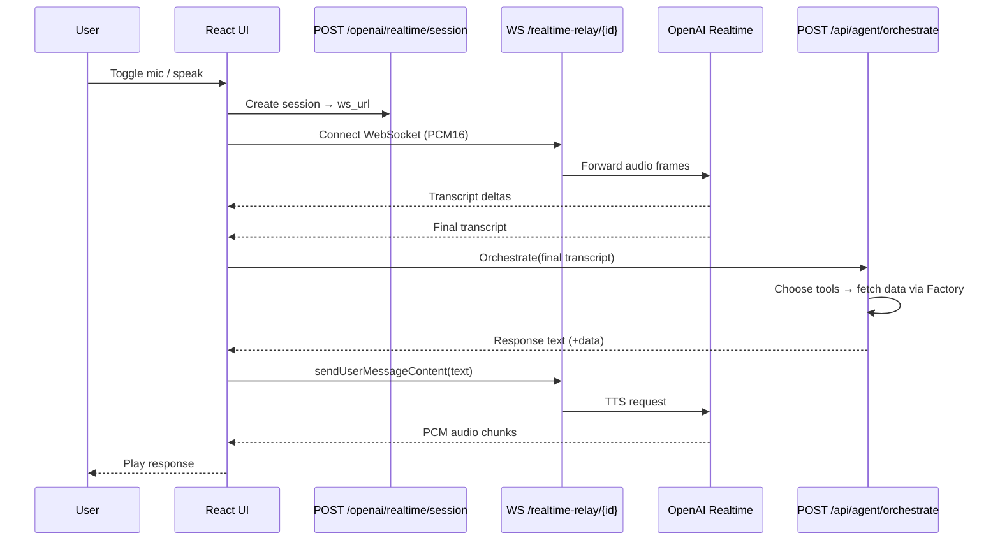
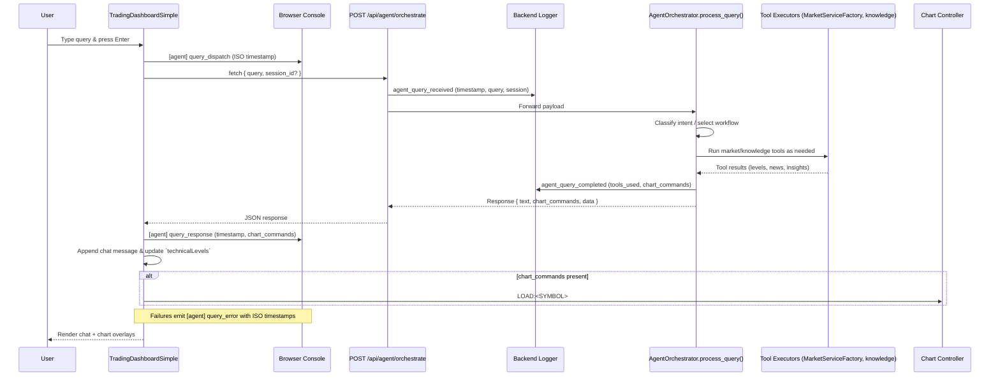
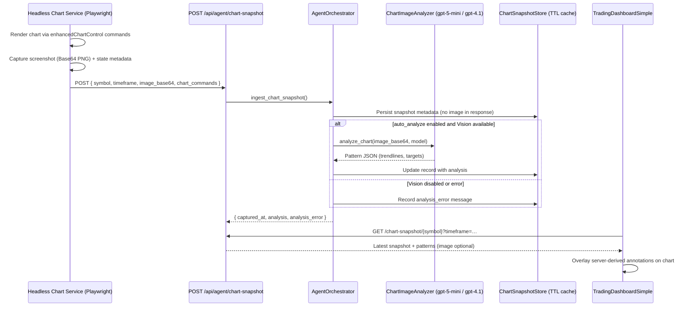
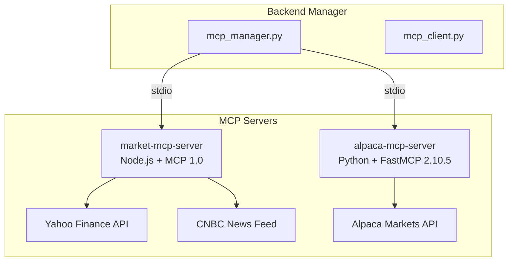

# GVSES AI Market Analysis Assistant – Architecture

## Current Architecture

```mermaid
graph TD
    subgraph Frontend (React/Vite)
        UI[TradingDashboardSimple]
        VoiceHook[useAgentVoiceConversation]
        AgentSvc[agentOrchestratorService]
        MarketSvc[marketDataService]
        RealtimeClient[OpenAIRealtimeService\n(Official SDK)]
    end

    subgraph Backend (FastAPI)
        FastAPI[mcp_server.py]
        SessionAPI[/openai/realtime/session\n→ returns ws url]
        Relay[/realtime-relay/{session_id}\nOpenAIRealtimeRelay\n(voice-only, no tools)]
        AgentAPI[/api/agent/*\n(orchestrate, stream, tools)]
        MarketAPI[/api/stock-*, /api/enhanced/*,\n/api/alpaca/*, /api/v1/dashboard*]
    end

    subgraph Market Layer
        Factory[MarketServiceFactory\nHybrid (Direct + MCP)]
        DirectSvc[DirectMarketDataService\n(Yahoo direct HTTP)]
        subgraph MCP Sidecars
            MarketMCP[market-mcp-server (Node)\nYahoo Finance + CNBC]
            AlpacaMCP[alpaca-mcp-server (Python)]
        end
    end

    subgraph External Services
        OpenAIRealtime[OpenAI Realtime API (STT/TTS)]
        OpenAIChat[OpenAI Responses/Chat]
        Yahoo[yahoo-finance2]
        CNBC[CNBC feed]
        AlpacaAPI[Alpaca REST/Data]
        Supabase[(Supabase Postgres)]
    end

    %% Frontend ↔ Backend
    UI --> MarketSvc --> MarketAPI
    UI --> AgentSvc --> AgentAPI
    RealtimeClient -. create .-> SessionAPI
    RealtimeClient --> Relay --> OpenAIRealtime
    VoiceHook -. final transcript .-> AgentSvc
    VoiceHook -. TTS text .-> RealtimeClient

    %% Agent ↔ Market
    AgentAPI -->|tools| Factory
    Factory --> DirectSvc --> Yahoo
    Factory --> MarketMCP --> Yahoo
    MarketMCP --> CNBC
    Factory --> AlpacaMCP --> AlpacaAPI

    %% Optional persistence (legacy /ws path)
    FastAPI -. ConversationManager .-> Supabase
```

### What Changed
- Hybrid market layer: MarketServiceFactory now combines Direct Yahoo calls with MCP sidecars (Alpaca + Yahoo/CNBC) and picks the best source per request.
- Voice relay refactor: `/openai/realtime/session` issues a session and WebSocket URL to `/realtime-relay/{session_id}`. The relay is voice-only; all tool execution happens in the agent orchestrator.
- Streaming text: `/api/agent/stream` provides SSE chunks (content, tool_start, tool_result, structured_data, done). Regular text uses `/api/agent/orchestrate`.

### End-to-End Voice Flow



### Text Query Flow (Dashboard Input)



### Chart Snapshot Pipeline (Headless Service → Orchestrator)



### Alpaca-First Market Data Architecture (Fixed Sep 26, 2025)

```mermaid
graph LR
    subgraph Market Data Flow
        Request[API Request]
        Factory[MarketServiceFactory]
        
        subgraph Primary Sources
            AlpacaDirect[AlpacaService\n(Direct API)\n✅ WORKING]
            AlpacaMCP[alpaca-mcp-server\n(FastMCP 2.10.5)\n✅ WORKING]
        end
        
        subgraph Fallback Sources
            YahooDirect[DirectMarketDataService\n(Yahoo HTTP)]
            YahooMCP[market-mcp-server\n(Node.js MCP)]
        end
        
        Request --> Factory
        Factory -->|1. Try First| AlpacaDirect
        AlpacaDirect -->|Success <500ms| Response[Response with\ndata_source: alpaca]
        AlpacaDirect -->|Fail/Timeout| YahooDirect
        YahooDirect -->|Success| Response2[Response with\ndata_source: yahoo_direct]
        YahooDirect -->|Fail| YahooMCP
        YahooMCP --> Response3[Response with\ndata_source: yahoo_mcp]
    end
```

#### Alpaca Integration Timeline
- **Aug 27, 2025**: Initial Alpaca implementation (never worked - env vars not loaded)
- **Sep 26, 2025 (Morning)**: Fixed environment variable loading issue
  - Added `load_dotenv()` before imports in:
    - `mcp_manager.py` (line 15)
    - `alpaca_service.py` (line 14)
    - `services/market_service.py` (line 14)
  - Fixed `GetPositionsRequest` import error in alpaca-mcp-server
- **Sep 26, 2025 (Afternoon)**: Fixed Alpaca MCP server startup
  - Added `load_dotenv()` to `alpaca-mcp-server/server.py` to load backend/.env
  - Converted from deprecated `mcp.server` to `FastMCP` 2.10.5
  - Updated all 11 tool decorators to use `@self.mcp.tool()`
  - Changed run method to use `FastMCP.run_stdio_async()`

#### Performance Metrics (After Fix - Sep 26, 2025)
| Data Source | Response Time | Status | Priority |
|-------------|--------------|---------|----------|
| Alpaca Direct | 300-500ms | ✅ Operational | Primary |
| Alpaca MCP | 500-800ms | ✅ Operational | Backup |
| Yahoo Direct | 400-700ms | ✅ Operational | Fallback 1 |
| Yahoo MCP | 3-15s | ✅ Operational | Fallback 2 |

### MCP Server Architecture



#### MCP Server Details
- **market-mcp-server**: Node.js implementation using MCP 1.0 protocol
  - 35+ Yahoo Finance tools (quotes, history, news, indicators)
  - CNBC news integration
  - Runs as subprocess via stdio communication
  
- **alpaca-mcp-server**: Python implementation using FastMCP 2.10.5
  - 11 Alpaca trading tools (account, positions, orders, market data)
  - Professional market data with 52-week ranges
  - Converted from deprecated `mcp.server` to FastMCP for compatibility

### Notes & Caching
- MarketServiceFactory maps crypto tickers (e.g., BTC → BTC-USD) and caches short-lived results.
- Agent orchestrator maintains LRU caches for knowledge, tool results, and full responses; optional vector retrieval for knowledge.
- Supabase persistence exists for the legacy `/ws/{session_id}` flow; the agent orchestrator endpoints do not rely on Supabase.
- Alpaca provides professional-grade market data with 52-week ranges, pre/post-market data, and sub-second response times.
- Both MCP servers load environment variables from backend/.env for API credentials.
