# GVSES AI Market Analysis Assistant - Architecture

## System Overview

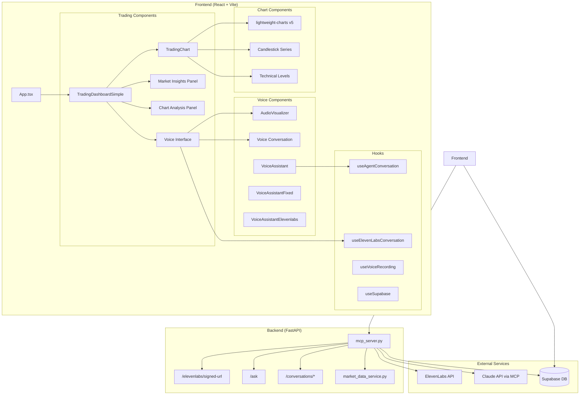

## Component Hierarchy

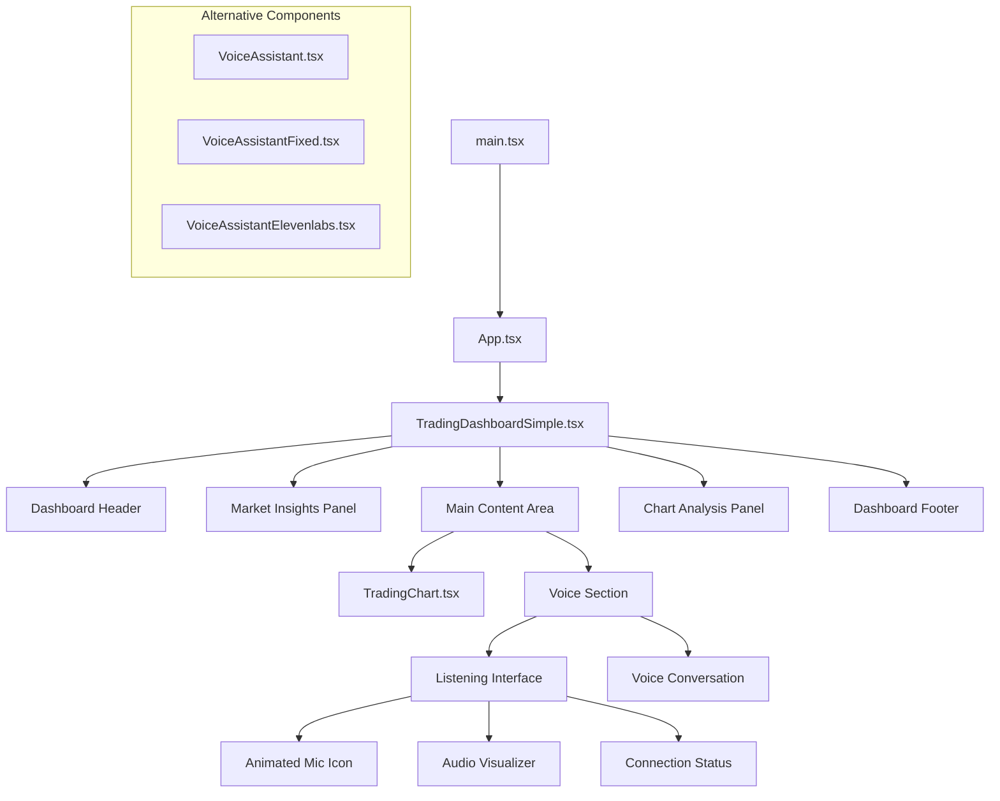

## Data Flow

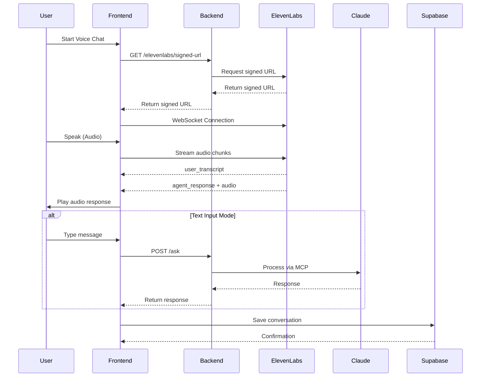

## File Structure

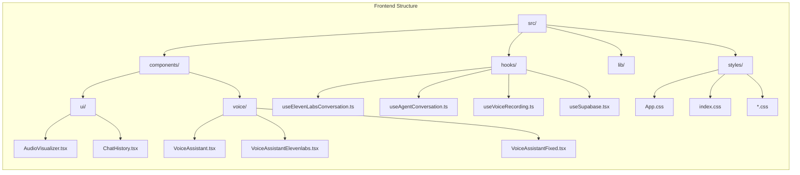

## WebSocket Communication Flow

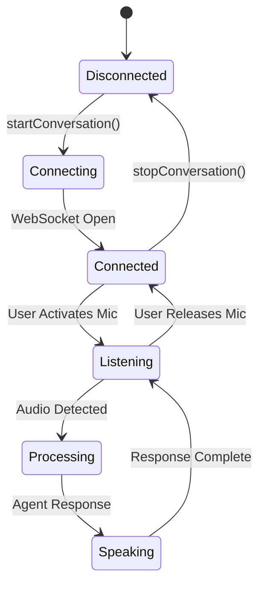

## API Endpoints

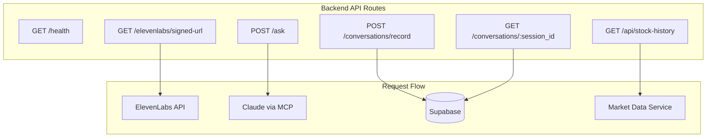

## Voice Processing Pipeline

```mermaid
graph LR
    subgraph "Audio Input"
        Microphone[Microphone] --> MediaStream[MediaStream API]
        MediaStream --> AudioContext[AudioContext]
        AudioContext --> PCM[PCM Audio Chunks]
    end
    
    subgraph "Processing"
        PCM --> WebSocket[WebSocket to ElevenLabs]
        WebSocket --> ASR[Speech Recognition]
        ASR --> LLM[LLM Processing]
        LLM --> TTS[Text-to-Speech]
    end
    
    subgraph "Audio Output"
        TTS --> AudioQueue[Audio Queue]
        AudioQueue --> AudioElement[Audio Element]
        AudioElement --> Speaker[Speaker]
    end
```

## State Management

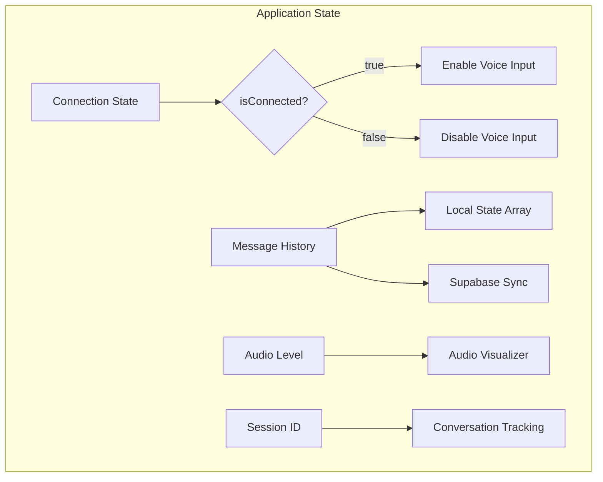

## Technology Stack

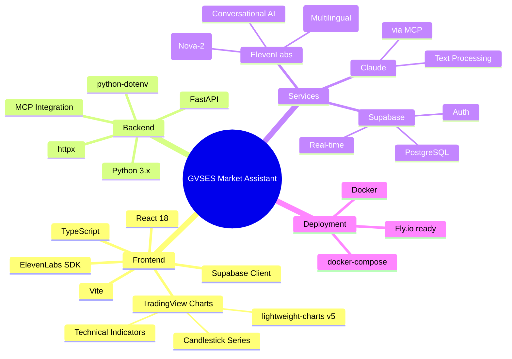

## Error Handling Flow

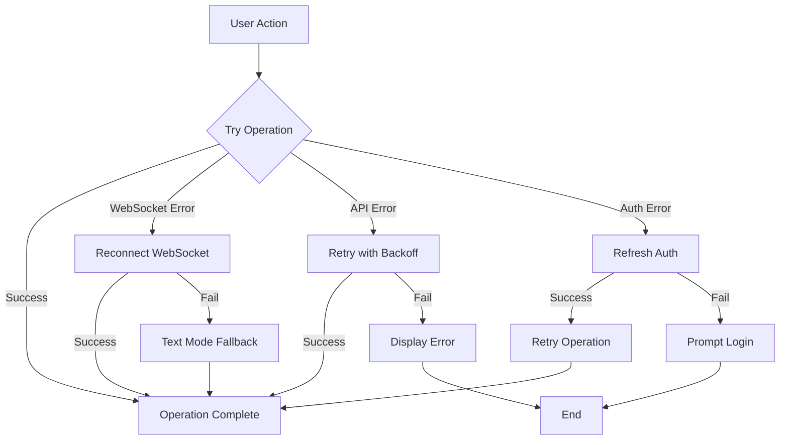

## Database Schema

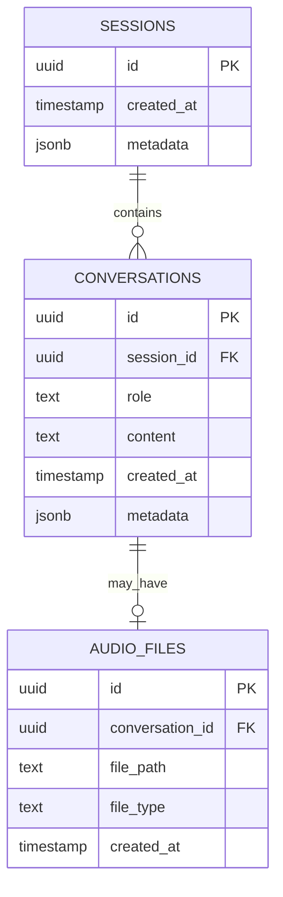

---

## Trading Dashboard Architecture

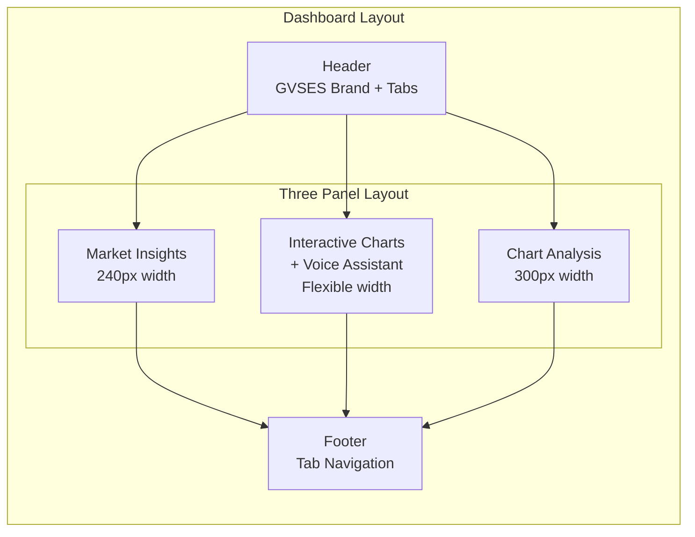

## Trading Dashboard State Flow

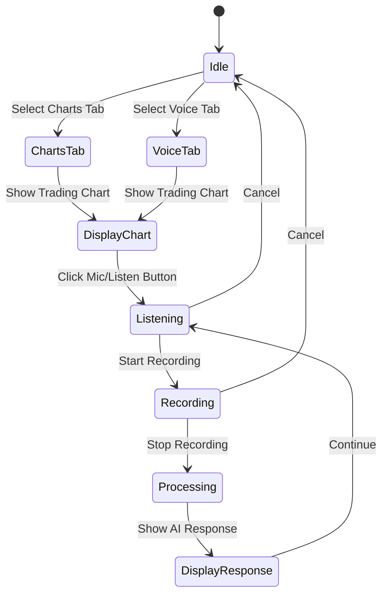

## Market Data Components

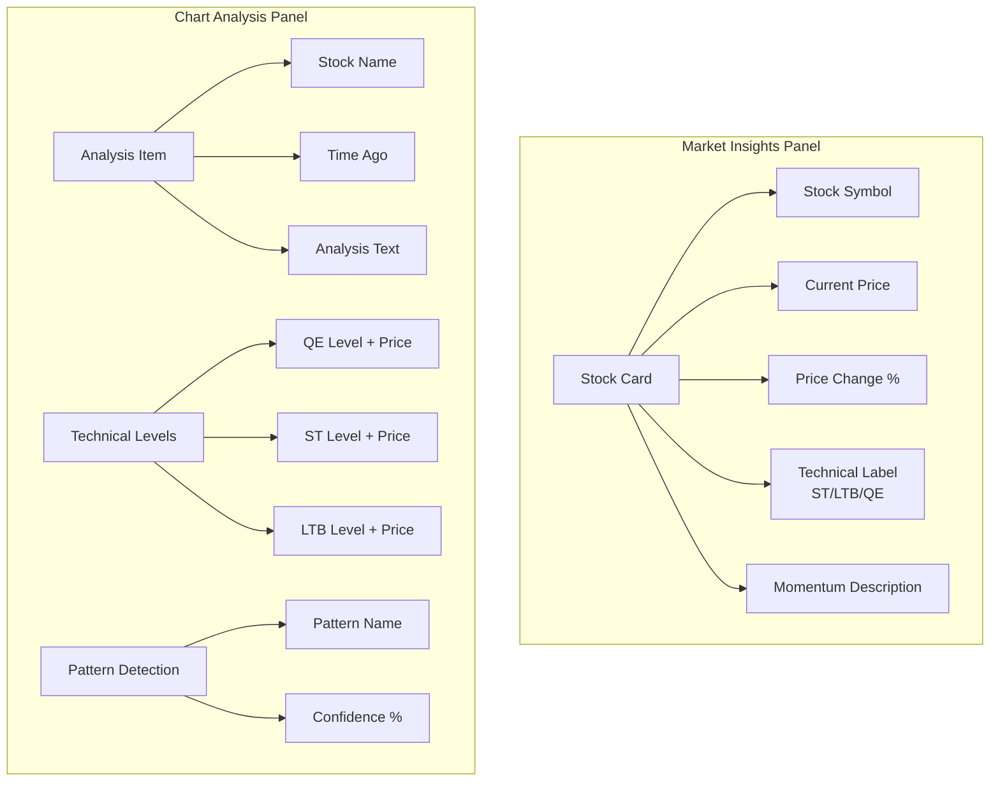

## Voice Interface Components

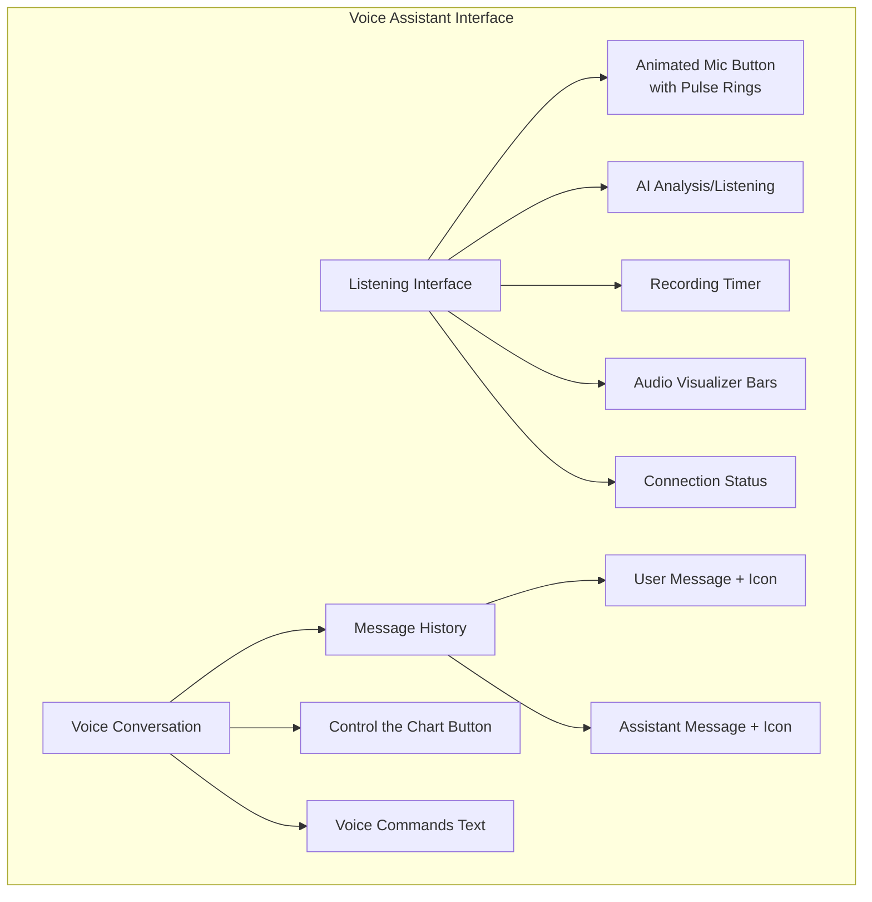

*Last Updated: 2025-08-24*
*This document represents the current architecture of the GVSES AI Market Analysis Assistant application.*