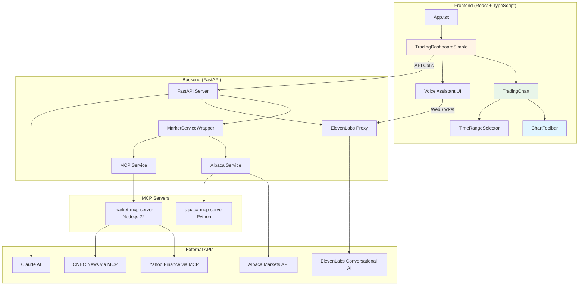
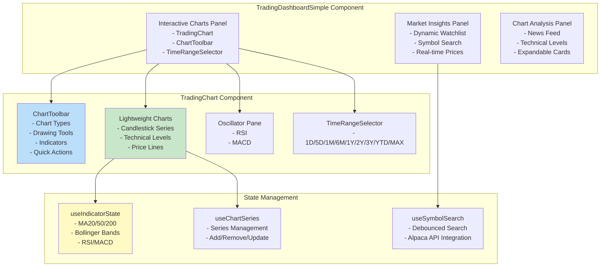
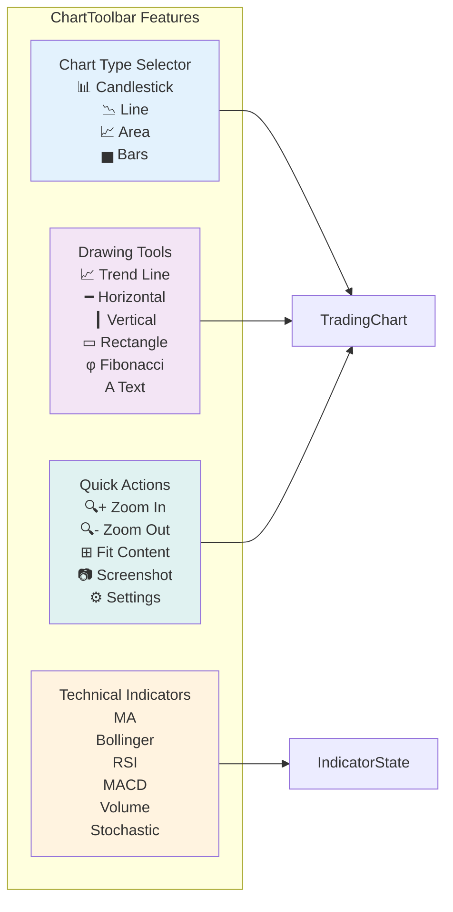
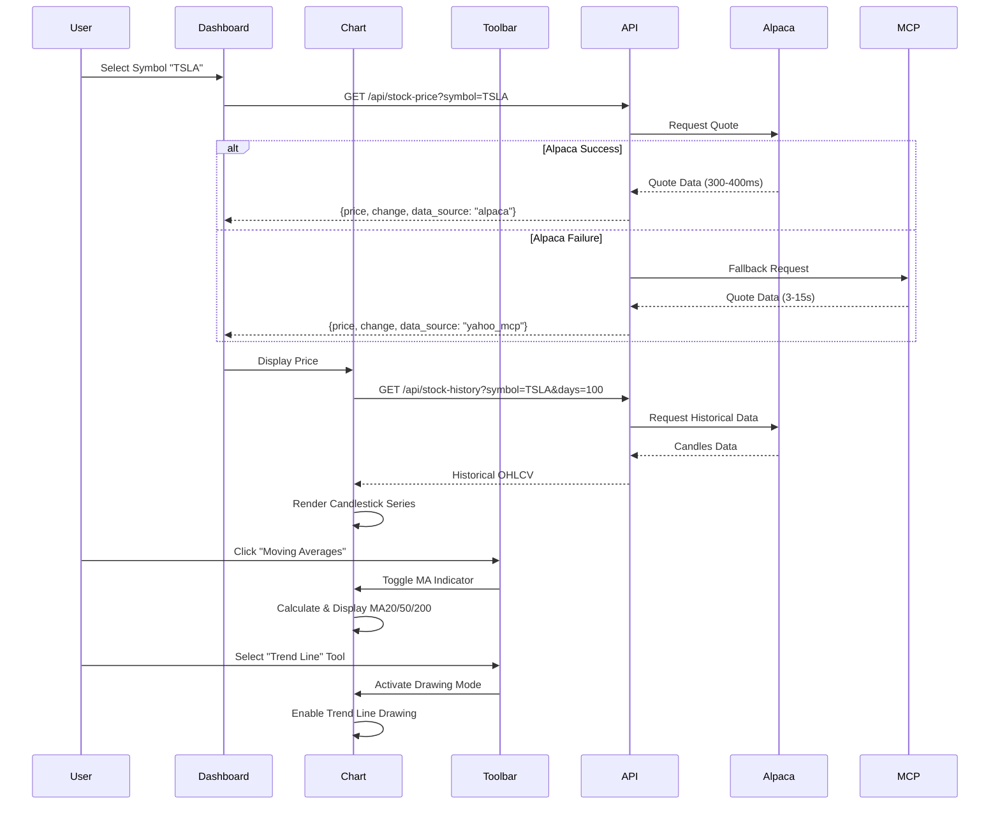

# GVSES Market Analysis Assistant - Architecture Diagrams

## System Architecture Overview



## Frontend Component Architecture



## ChartToolbar Component Structure



## Data Flow Architecture



## Performance Characteristics

| Component | Response Time | Data Source |
|-----------|---------------|-------------|
| Stock Quote (Alpaca) | 300-400ms | Alpaca Markets |
| Stock Quote (MCP Fallback) | 3-15s | Yahoo Finance |
| Historical Data (Alpaca) | 400-500ms | Alpaca Markets |
| News Feed (MCP) | 3-5s | CNBC + Yahoo |
| Symbol Search | <500ms | Alpaca Asset DB |
| Voice Command Processing | 1-3s | ElevenLabs AI |
| Chart Render | <100ms | Client-side |

## Recent Updates

### Knowledge Base → Chart Tools Integration (Oct 2, 2025)
- **ChartToolRegistry Service**: Auto-registers chart capabilities from knowledge base as callable tools
- **Tool Discovery API**: `/api/agent/tools/chart` endpoint returns all available chart tools with knowledge context
- **Semantic Tool Search**: `/api/agent/tools/chart/search` for natural language tool discovery
- **OpenAI Tool Mapper Integration**: Chart control tools automatically added to OpenAI function calling
- **Frontend chartToolService**: Unified access to knowledge-based chart tools
- **Voice Command Integration**: Knowledge-based tool mapping in `chartControlService.parseAgentResponse()`
- **Knowledge → Tool Mapping**: RSI, MACD, Bollinger, MA indicators mapped from knowledge base topics

**Architecture Flow**:
```
User Voice Command → chartToolService.mapVoiceCommandToTool()
                  → Semantic Search on Knowledge Base
                  → Match to ChartTool (RSI, MACD, etc.)
                  → Generate Frontend Command (INDICATOR:RSI)
                  → Execute via chartControlService
```

### ChartToolbar (Oct 2, 2025)
- Added TradingView-style toolbar component
- Chart type selector (Candlestick, Line, Area, Bars)
- Drawing tools panel with 6 tools
- Technical indicators quick access
- Quick actions (Zoom, Fit, Screenshot, Settings)
- Integrated with existing indicator system

### TimeRangeSelector Styling Fix (Oct 1, 2025)
- Fixed unstyled button display issue
- Added comprehensive CSS styling
- Flexbox layout with proper spacing
- Hover and active states
- Touch-friendly 44px minimum width
