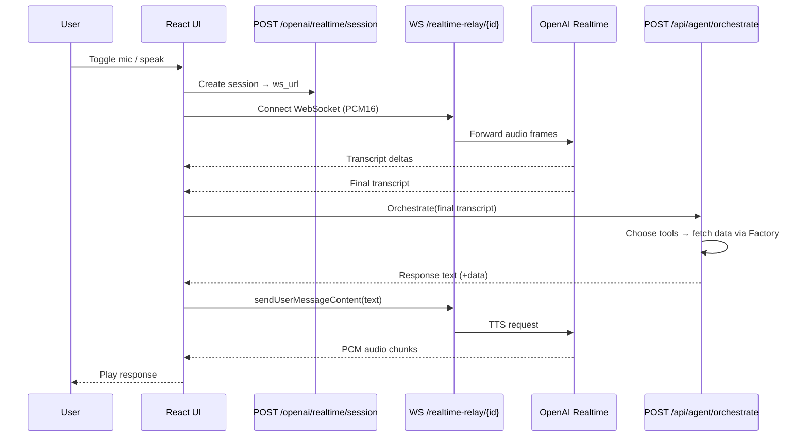
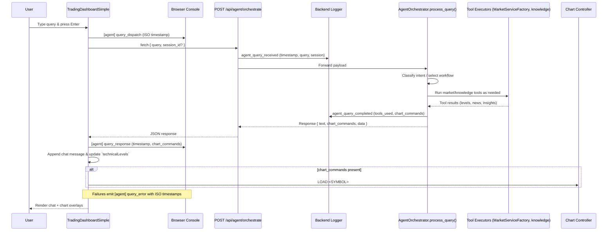

# GVSES AI Market Analysis Assistant – Architecture

## Current Architecture

```mermaid
graph TD
    subgraph Frontend (React/Vite)
        UI[TradingDashboardSimple]
        VoiceHook[useAgentVoiceConversation]
        AgentSvc[agentOrchestratorService]
        MarketSvc[marketDataService]
        RealtimeClient[OpenAIRealtimeService\n(Official SDK)]
    end

    subgraph Backend (FastAPI)
        FastAPI[mcp_server.py]
        SessionAPI[/openai/realtime/session\n→ returns ws url]
        Relay[/realtime-relay/{session_id}\nOpenAIRealtimeRelay\n(voice-only, no tools)]
        AgentAPI[/api/agent/*\n(orchestrate, stream, tools)]
        MarketAPI[/api/stock-*, /api/enhanced/*,\n/api/alpaca/*, /api/v1/dashboard*]
    end

    subgraph Market Layer
        Factory[MarketServiceFactory\nHybrid (Direct + MCP)]
        DirectSvc[DirectMarketDataService\n(Yahoo direct HTTP)]
        subgraph MCP Sidecars
            MarketMCP[market-mcp-server (Node)\nYahoo Finance + CNBC]
            AlpacaMCP[alpaca-mcp-server (Python)]
        end
    end

    subgraph External Services
        OpenAIRealtime[OpenAI Realtime API (STT/TTS)]
        OpenAIChat[OpenAI Responses/Chat]
        Yahoo[yahoo-finance2]
        CNBC[CNBC feed]
        AlpacaAPI[Alpaca REST/Data]
        Supabase[(Supabase Postgres)]
    end

    %% Frontend ↔ Backend
    UI --> MarketSvc --> MarketAPI
    UI --> AgentSvc --> AgentAPI
    RealtimeClient -. create .-> SessionAPI
    RealtimeClient --> Relay --> OpenAIRealtime
    VoiceHook -. final transcript .-> AgentSvc
    VoiceHook -. TTS text .-> RealtimeClient

    %% Agent ↔ Market
    AgentAPI -->|tools| Factory
    Factory --> DirectSvc --> Yahoo
    Factory --> MarketMCP --> Yahoo
    MarketMCP --> CNBC
    Factory --> AlpacaMCP --> AlpacaAPI

    %% Optional persistence (legacy /ws path)
    FastAPI -. ConversationManager .-> Supabase
```

### What Changed
- Hybrid market layer: MarketServiceFactory now combines Direct Yahoo calls with MCP sidecars (Alpaca + Yahoo/CNBC) and picks the best source per request.
- Voice relay refactor: `/openai/realtime/session` issues a session and WebSocket URL to `/realtime-relay/{session_id}`. The relay is voice-only; all tool execution happens in the agent orchestrator.
- Streaming text: `/api/agent/stream` provides SSE chunks (content, tool_start, tool_result, structured_data, done). Regular text uses `/api/agent/orchestrate`.

### End-to-End Voice Flow



### Text Query Flow (Dashboard Input)



### Notes & Caching
- MarketServiceFactory maps crypto tickers (e.g., BTC → BTC-USD) and caches short-lived results.
- Agent orchestrator maintains LRU caches for knowledge, tool results, and full responses; optional vector retrieval for knowledge.
- Supabase persistence exists for the legacy `/ws/{session_id}` flow; the agent orchestrator endpoints do not rely on Supabase.
