# GVSES System Architecture - Mermaid Diagrams

## 1. OpenAI Agent Builder Workflow (v44 - Production)

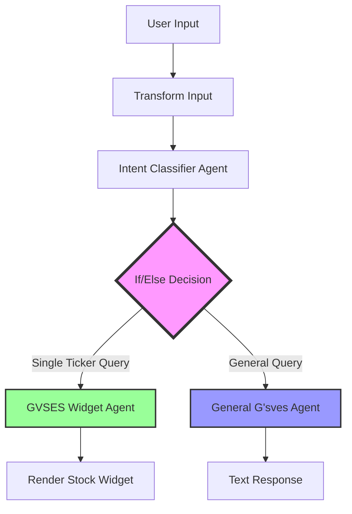

### If/Else Condition Logic (v44)
```javascript
// Routes to GVSES Widget Agent if:
(input.intent == "market_data" || input.intent == "chart_command")
&& input.symbol
&& input.symbol.length > 0
&& !input.symbol.contains(',')
&& !input.symbol.contains(' ')

// Otherwise routes to General G'sves Agent
```

## 2. GVSES Widget Agent Data Flow

```mermaid
graph LR
    A[User Query: "show me AAPL"] --> B[Intent Classifier]
    B --> C{Intent Type}
    C -->|market_data| D[Extract Symbol]
    C -->|chart_command| D

    D --> E{Validate Symbol}
    E -->|Single Ticker| F[Call MCP Tools]
    E -->|Multiple/None| G[General Agent]

    F --> F1[get_stock_quote]
    F --> F2[get_stock_history]
    F --> F3[get_market_news]
    F --> F4[get_earnings_calendar]

    F1 --> H[Format JSON Response]
    F2 --> H
    F3 --> H
    F4 --> H

    H --> I{Validate 15 Fields}
    I -->|All Present| J[Render Widget]
    I -->|Missing Fields| K[Widget Fails Silently]

    style F fill:#9f9,stroke:#333,stroke-width:2px
    style H fill:#ff9,stroke:#333,stroke-width:2px
    style J fill:#9f9,stroke:#333,stroke-width:2px
    style K fill:#f99,stroke:#333,stroke-width:2px
```

## 3. Widget JSON Schema (15 Required Fields)

```mermaid
graph TD
    JSON[Widget JSON Response] --> BasicInfo[Basic Info]
    JSON --> Price[Price Data]
    JSON --> Chart[Chart Data]
    JSON --> Stats[Stats]
    JSON --> Technical[Technical Analysis]
    JSON --> Patterns[Patterns]
    JSON --> News[News]
    JSON --> Events[Events]

    BasicInfo --> B1[1. company]
    BasicInfo --> B2[2. symbol]
    BasicInfo --> B3[3. analysis]
    BasicInfo --> B4[4. timestamp]

    Price --> P1[5. price.current]
    Price --> P2[price.changeLabel]
    Price --> P3[price.changeColor]
    Price --> P4[price.afterHours?]

    Chart --> C1[6. timeframes]
    Chart --> C2[7. selectedTimeframe]
    Chart --> C3[8. chartData]

    Stats --> S1[9. stats.open/volume/marketCap]
    Stats --> S2[stats.dayLow/High]
    Stats --> S3[stats.yearLow/High]
    Stats --> S4[stats.eps/peRatio]

    Technical --> T1[10. technical.position]
    Technical --> T2[technical.color]
    Technical --> T3[technical.levels]

    Patterns --> PA1[11. patterns array]

    News --> N1[12. newsFilters]
    News --> N2[13. selectedSource]
    News --> N3[14. news array]

    Events --> E1[15. events array ⚠️]

    style E1 fill:#f99,stroke:#333,stroke-width:4px
    style JSON fill:#9f9,stroke:#333,stroke-width:2px
```

## 4. Chart Component Rendering Flow

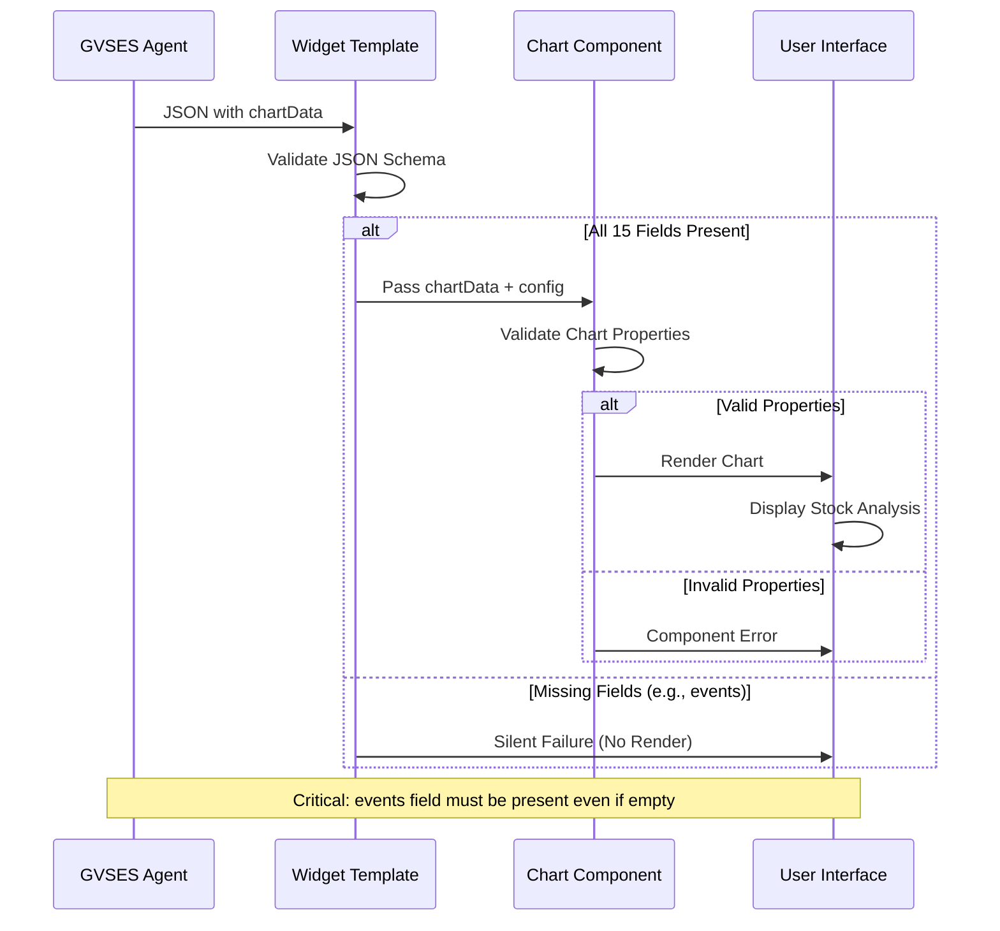

## 5. Intent Classification Decision Tree

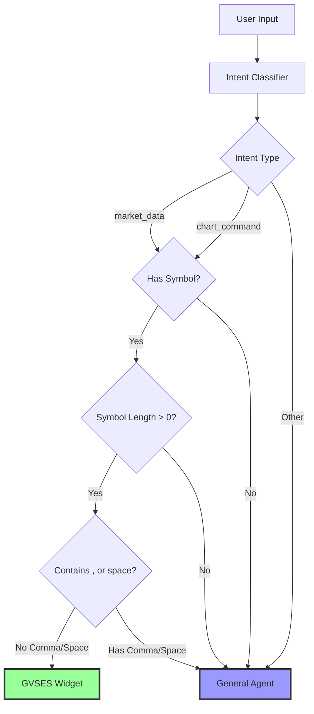

## 6. Example Query Routing (v44)

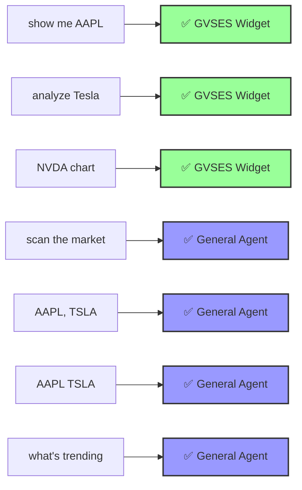

## 7. System Architecture Overview

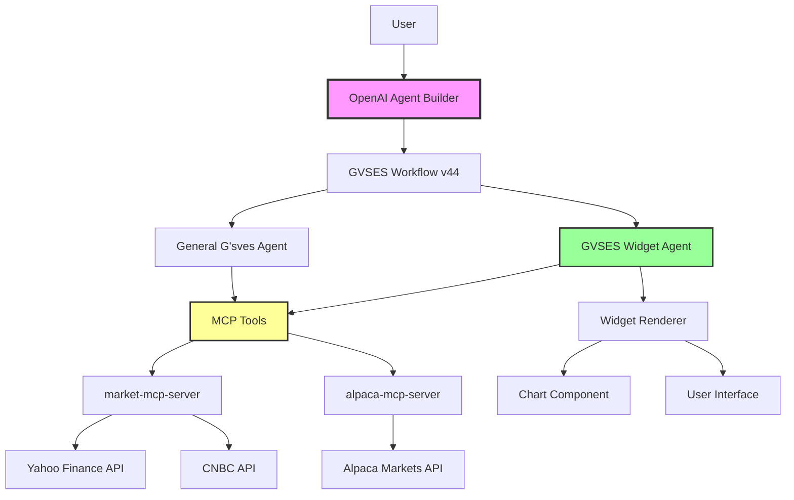

## 8. Widget Validation Flow

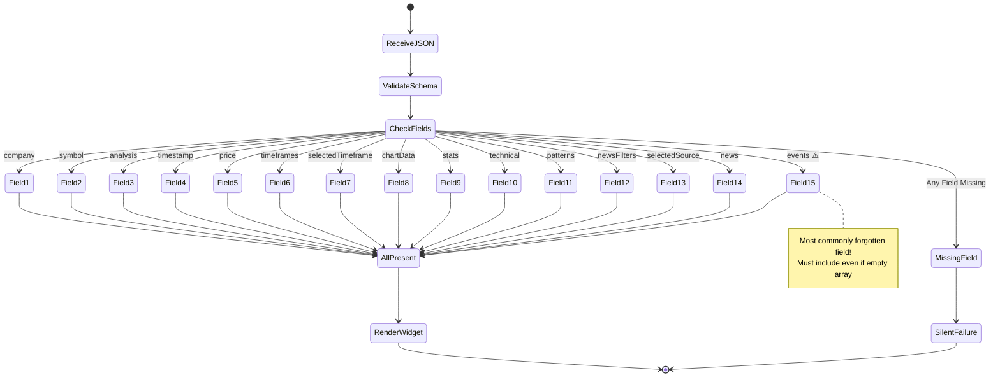

## 9. Pattern Detection & Key Levels Data Flow (Dec 14, 2025)

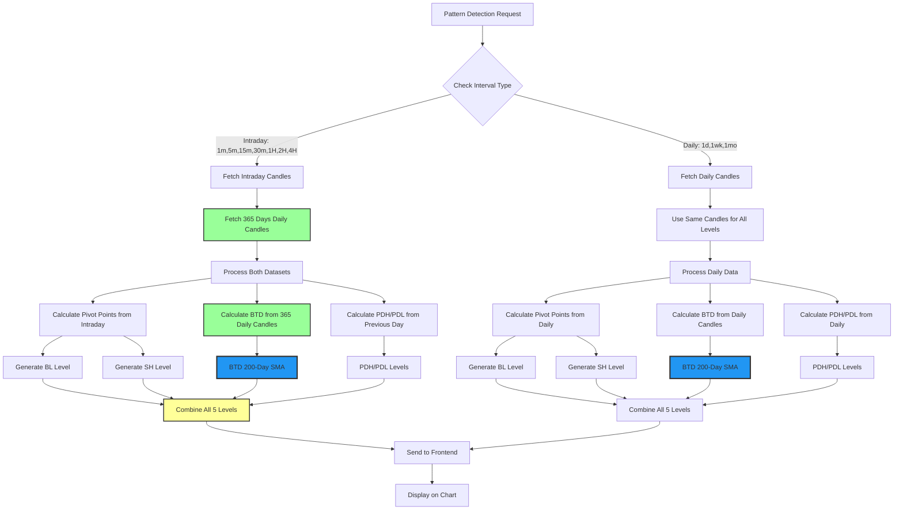

### Key Level Types and Data Sources

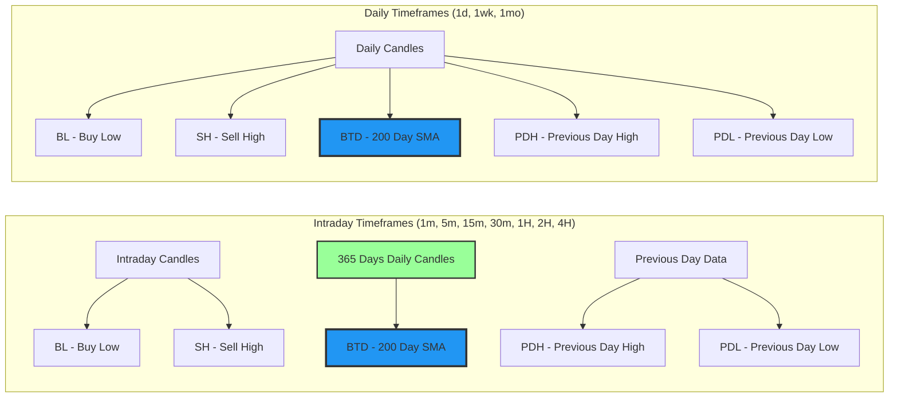

### BTD Calculation Consistency

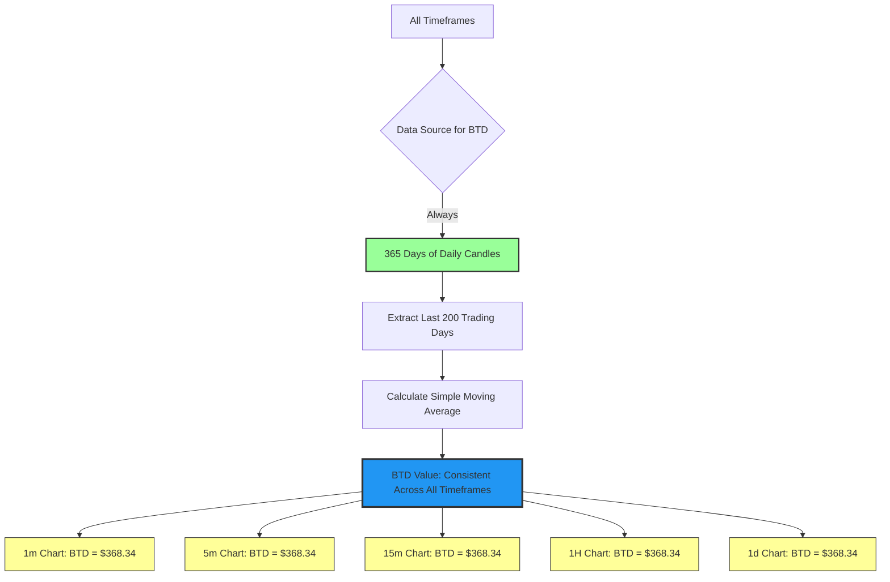

## 10. 3-Tier Historical Data Caching Architecture (Dec 20, 2025)

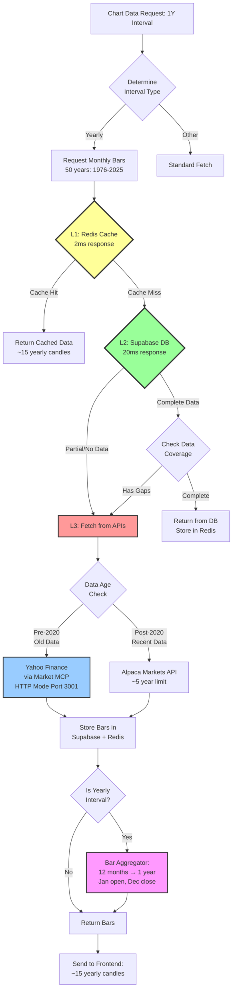

### Cache Performance Metrics

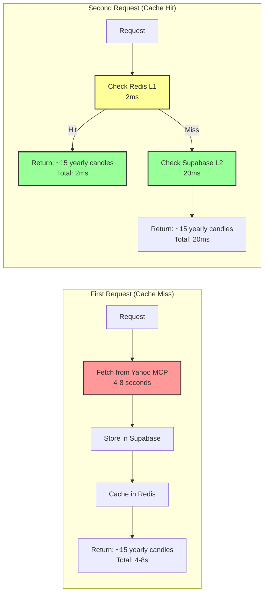

## 11. Yearly Aggregation Data Flow

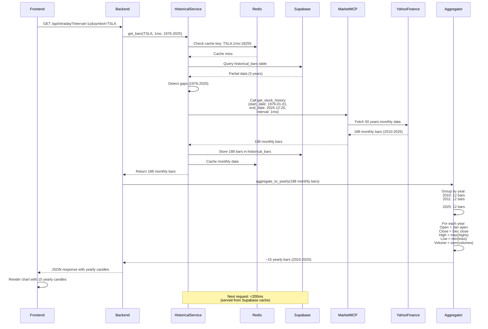

## 12. Market MCP Server Extension (Absolute Date Ranges)

```mermaid
graph TB
    Request[Historical Data Request] --> CheckParams{Check<br/>Parameters}

    CheckParams -->|Has start_date<br/>& end_date| AbsoluteDates[Use Absolute Date Range<br/>Supports 50+ years]
    CheckParams -->|Has period only| RelativePeriod[Use Relative Period<br/>Max 5 years]

    AbsoluteDates --> ParseDates[Parse ISO Dates:<br/>period1 = new Date(start_date)<br/>period2 = new Date(end_date)]
    RelativePeriod --> GetPeriodDate[Use getPeriodDate():<br/>1d, 5d, 1mo, 3mo, 6mo,<br/>1y, 2y, 5y]

    ParseDates --> YahooAPI[Yahoo Finance API Call:<br/>yahooFinance.historical()]
    GetPeriodDate --> YahooAPI

    YahooAPI --> ProcessData[Process OHLCV Bars]

    ProcessData --> Return[Return Historical Data<br/>Monthly/Daily/Intraday]

    style AbsoluteDates fill:#9f9,stroke:#333,stroke-width:3px
    style RelativePeriod fill:#ff9,stroke:#333,stroke-width:2px
    style YahooAPI fill:#9cf,stroke:#333,stroke-width:2px
```

### Extended API Parameters

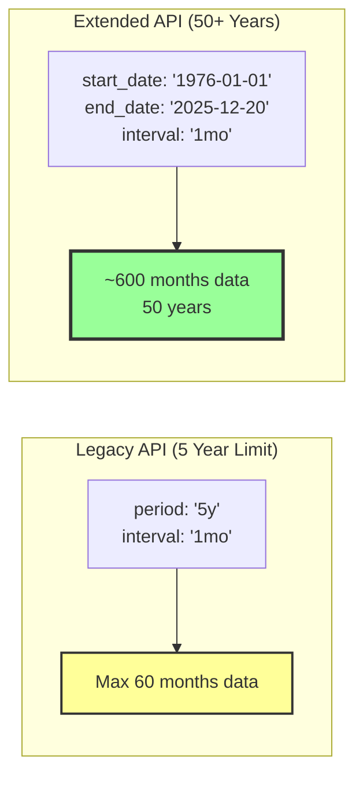

## 13. Database Schema (Historical Data Storage)

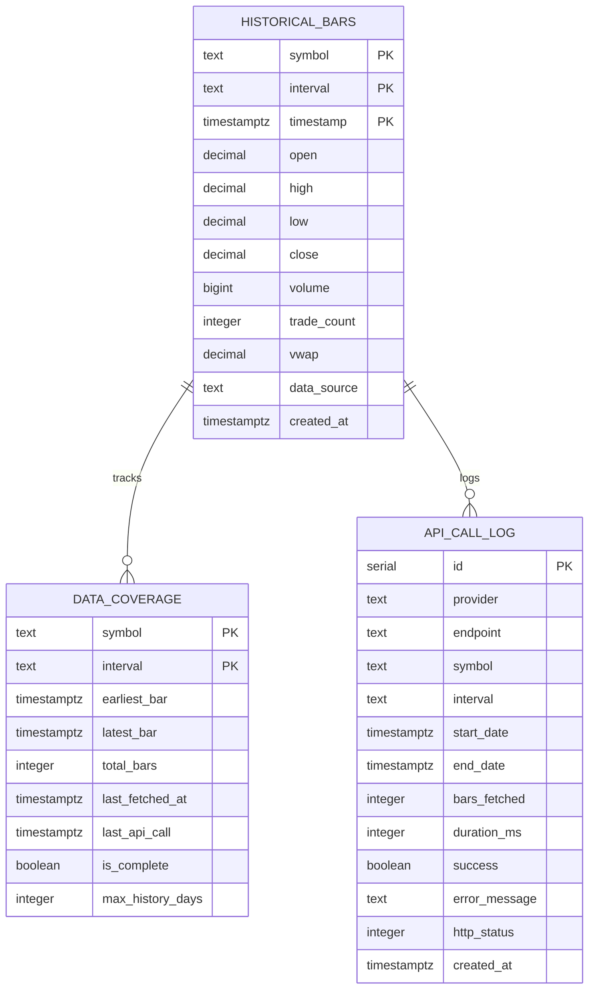

### Storage Example (TSLA Monthly Data)

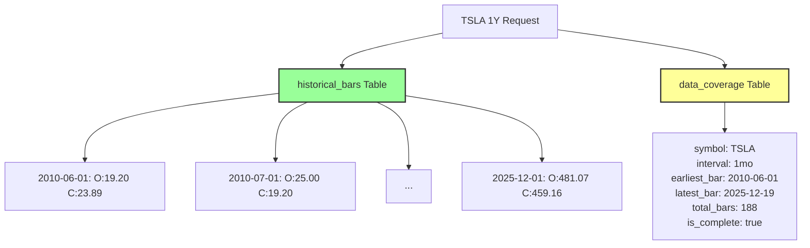

## Version History

- **Dec 20, 2025**: Added 3-tier caching architecture, yearly aggregation, and Market MCP server extension diagrams
- **v44 (Current Production)**: Fixed CEL syntax error, replaced JavaScript regex with CEL-compatible string methods
- **v43 (Deprecated)**: Had JavaScript regex syntax error in if/else condition
- **Earlier Versions**: Various iterations of widget and agent improvements

## Critical Notes

1. **CEL Syntax**: OpenAI Agent Builder uses Common Expression Language, NOT JavaScript
2. **Events Field**: Must always be included in JSON response, even as empty array `[]`
3. **Single Ticker Routing**: Uses string methods `contains()` instead of regex for validation
4. **Silent Failures**: Missing required fields cause widget to fail without error messages
5. **Chart Properties**: Only use officially supported Chart component properties
6. **BTD (200-Day SMA)**: Always calculated from 365 days of daily candles, regardless of current timeframe, ensuring consistent reference level
7. **3-Tier Cache**: Redis (L1) → Supabase (L2) → API (L3) for optimal performance and cost reduction
8. **Market MCP HTTP Mode**: Must run on port 3001 for historical data service to access Yahoo Finance data
9. **Yearly Aggregation**: Converts monthly bars to yearly candles using Jan open, Dec close, year high/low

---

Last Updated: 2025-12-20 (3-Tier Caching & Yearly Aggregation Implementation)
