# GVSES Market Analysis Assistant - Architecture Diagrams

## System Architecture Overview with OpenAI Agent Builder Integration


## Frontend Component Architecture


## ChartToolbar Component Structure

```mermaid
graph LR
    subgraph "ChartToolbar Features"
        ChartType[Chart Type Selector<br/>📊 Candlestick<br/>📉 Line<br/>📈 Area<br/>▅ Bars]
        DrawTools[Drawing Tools<br/>📈 Trend Line<br/>━ Horizontal<br/>┃ Vertical<br/>▭ Rectangle<br/>φ Fibonacci<br/>A Text]
        Indicators[Technical Indicators<br/>MA<br/>Bollinger<br/>RSI<br/>MACD<br/>Volume<br/>Stochastic]
        Actions[Quick Actions<br/>🔍+ Zoom In<br/>🔍- Zoom Out<br/>⊞ Fit Content<br/>📷 Screenshot<br/>⚙️ Settings]
    end

    ChartType --> TradingChart
    DrawTools --> TradingChart
    Indicators --> IndicatorState
    Actions --> TradingChart

    style ChartType fill:#e3f2fd
    style DrawTools fill:#f3e5f5
    style Indicators fill:#fff3e0
    style Actions fill:#e0f2f1
```



## Data Flow Architecture


## Performance Characteristics

| Component | Response Time | Data Source |
|-----------|---------------|-------------|
| Stock Quote (Alpaca) | 300-400ms | Alpaca Markets |
| Stock Quote (MCP Fallback) | 3-15s | Yahoo Finance |
| Historical Data (Alpaca) | 400-500ms | Alpaca Markets |
| News Feed (MCP) | 3-5s | CNBC + Yahoo |
| Symbol Search | <500ms | Alpaca Asset DB |
| Voice Command Processing | 1-3s | ElevenLabs AI |
| Chart Render | <100ms | Client-side |

## Voice Command Flow with Agent Builder


## Triple Voice Provider Architecture


## Agent Builder Enhancement Roadmap

```mermaid
graph TD
    subgraph "Current State (85% Complete)"
        C1[✅ Intent Classifier]
        C2[✅ If/Else Routing]
        C3[✅ MCP Integration]
        C4[✅ Transform Nodes]
        C5[✅ Agent Nodes]
        C6[✅ End Nodes]
    end
    
    subgraph "Missing Components (15%)"
        M1[⏳ File Search<br/>Vector DB Integration]
        M2[⏳ Guardrails<br/>Content Moderation]
        M3[⏳ While Loops<br/>Retry Logic]
        M4[⏳ User Approval<br/>Trade Confirmation]
        M5[⏳ Set State<br/>Variable Management]
    end
    
    subgraph "Benefits When Complete"
        B1[Visual Workflow Editing]
        B2[No-Code Modifications]
        B3[Real-time Testing]
        B4[Version Control]
        B5[A/B Testing Flows]
    end
    
    C1 --> B1
    M1 --> B2
    M2 --> B3
    M3 --> B4
    M4 --> B5
    
    style C1 fill:#c8e6c9
    style C2 fill:#c8e6c9
    style C3 fill:#c8e6c9
    style M1 fill:#fff9c4
    style M2 fill:#fff9c4
```



## System Integration Points


## Recent Updates

### OpenAI Agent Builder Integration (Oct 11, 2025)
- **Workflow Created**: Intent Classifier → If/Else → Market Data/MCP branches
- **85% Complete**: Missing File Search, Guardrails, While loops, User Approval
- **Integration Points**: Direct connection to MarketServiceWrapper and MCP servers
- **Future Vision**: Visual workflow editing replacing code-based orchestration

### Deep System Investigation (Oct 11, 2025)
- **Triple Voice Provider System**: ElevenLabs + OpenAI Realtime + Internal Agent
- **Performance Metrics Documented**: Alpaca (300-400ms) vs MCP (3-15s)
- **Security Issue Found**: Hardcoded API key in test_openai_realtime.py
- **Architecture Validated**: Professional-grade with intelligent fallbacks

### Knowledge Base → Chart Tools Integration (Oct 2, 2025)
- **ChartToolRegistry Service**: Auto-registers chart capabilities from knowledge base as callable tools
- **Tool Discovery API**: `/api/agent/tools/chart` endpoint returns all available chart tools with knowledge context
- **Semantic Tool Search**: `/api/agent/tools/chart/search` for natural language tool discovery
- **OpenAI Tool Mapper Integration**: Chart control tools automatically added to OpenAI function calling
- **Frontend chartToolService**: Unified access to knowledge-based chart tools
- **Voice Command Integration**: Knowledge-based tool mapping in `chartControlService.parseAgentResponse()`
- **Knowledge → Tool Mapping**: RSI, MACD, Bollinger, MA indicators mapped from knowledge base topics

**Architecture Flow**:
```
User Voice Command → chartToolService.mapVoiceCommandToTool()
                  → Semantic Search on Knowledge Base
                  → Match to ChartTool (RSI, MACD, etc.)
                  → Generate Frontend Command (INDICATOR:RSI)
                  → Execute via chartControlService
```

### ChartToolbar (Oct 2, 2025)
- Added TradingView-style toolbar component
- Chart type selector (Candlestick, Line, Area, Bars)
- Drawing tools panel with 6 tools
- Technical indicators quick access
- Quick actions (Zoom, Fit, Screenshot, Settings)
- Integrated with existing indicator system

### TimeRangeSelector Styling Fix (Oct 1, 2025)
- Fixed unstyled button display issue
- Added comprehensive CSS styling
- Flexbox layout with proper spacing
- Hover and active states
- Touch-friendly 44px minimum width

## Security & Optimization Recommendations

### Critical Security Issues
1. **Hardcoded API Key**: Remove from `backend/test_openai_realtime.py`
2. **Environment Variables**: Ensure all keys in `.env` files only
3. **API Key Rotation**: Implement regular key rotation policy

### Performance Optimizations
1. **Redis Caching**: Implement for frequent stock queries
2. **Circuit Breaker**: Add for Alpaca API failures
3. **Request Batching**: Combine multiple symbol requests
4. **WebSocket Pooling**: Reuse connections for efficiency

### Agent Builder Enhancements Needed
1. **File Search Node**: Connect to vector database for knowledge queries
2. **Guardrails Node**: Add content moderation for trading commands
3. **While Loop**: Implement retry logic before fallback
4. **User Approval**: Require confirmation for trades
5. **Set State Node**: Manage conversation variables
