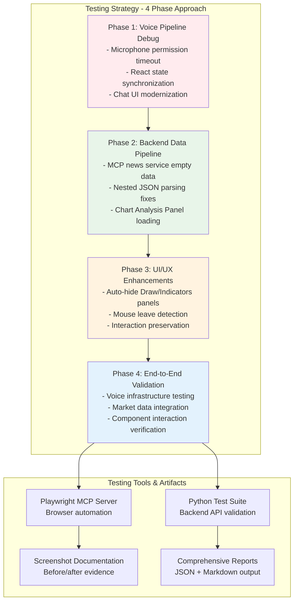
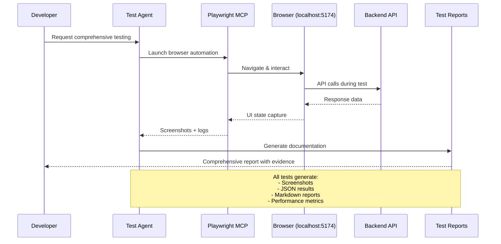

# GVSES Market Analysis Assistant - Architecture Diagrams

## System Architecture Overview with OpenAI Agent Builder Integration


## Frontend Component Architecture


## ChartToolbar Component Structure

```mermaid
graph LR
    subgraph "ChartToolbar Features"
        ChartType[Chart Type Selector<br/>📊 Candlestick<br/>📉 Line<br/>📈 Area<br/>▅ Bars]
        DrawTools[Drawing Tools<br/>📈 Trend Line<br/>━ Horizontal<br/>┃ Vertical<br/>▭ Rectangle<br/>φ Fibonacci<br/>A Text]
        Indicators[Technical Indicators<br/>MA<br/>Bollinger<br/>RSI<br/>MACD<br/>Volume<br/>Stochastic]
        Actions[Quick Actions<br/>🔍+ Zoom In<br/>🔍- Zoom Out<br/>⊞ Fit Content<br/>📷 Screenshot<br/>⚙️ Settings]
    end

    ChartType --> TradingChart
    DrawTools --> TradingChart
    Indicators --> IndicatorState
    Actions --> TradingChart

    style ChartType fill:#e3f2fd
    style DrawTools fill:#f3e5f5
    style Indicators fill:#fff3e0
    style Actions fill:#e0f2f1
```



## Data Flow Architecture


## Performance Characteristics

| Component | Response Time | Data Source |
|-----------|---------------|-------------|
| Stock Quote (Alpaca) | 300-400ms | Alpaca Markets |
| Stock Quote (MCP Fallback) | 3-15s | Yahoo Finance |
| Historical Data (Alpaca) | 400-500ms | Alpaca Markets |
| News Feed (MCP) | 3-5s | CNBC + Yahoo |
| Symbol Search | <500ms | Alpaca Asset DB |
| Voice Command Processing | 1-3s | ElevenLabs AI |
| Chart Render | <100ms | Client-side |

## Voice Command Flow with Agent Builder


## Triple Voice Provider Architecture


## Agent Builder Enhancement Roadmap

```mermaid
graph TD
    subgraph "Current State (85% Complete)"
        C1[✅ Intent Classifier]
        C2[✅ If/Else Routing]
        C3[✅ MCP Integration]
        C4[✅ Transform Nodes]
        C5[✅ Agent Nodes]
        C6[✅ End Nodes]
    end
    
    subgraph "Missing Components (15%)"
        M1[⏳ File Search<br/>Vector DB Integration]
        M2[⏳ Guardrails<br/>Content Moderation]
        M3[⏳ While Loops<br/>Retry Logic]
        M4[⏳ User Approval<br/>Trade Confirmation]
        M5[⏳ Set State<br/>Variable Management]
    end
    
    subgraph "Benefits When Complete"
        B1[Visual Workflow Editing]
        B2[No-Code Modifications]
        B3[Real-time Testing]
        B4[Version Control]
        B5[A/B Testing Flows]
    end
    
    C1 --> B1
    M1 --> B2
    M2 --> B3
    M3 --> B4
    M4 --> B5
    
    style C1 fill:#c8e6c9
    style C2 fill:#c8e6c9
    style C3 fill:#c8e6c9
    style M1 fill:#fff9c4
    style M2 fill:#fff9c4
```



## System Integration Points


## Comprehensive Testing Flow (Oct 16, 2025)



## Component Failure Patterns & Debugging

```mermaid
graph LR
    subgraph "Voice Pipeline Failures"
        VF1[Microphone Permission<br/>getUserMedia() hanging<br/>Solution: Timeout wrapper]
        VF2[State Synchronization<br/>OpenAI connected but UI shows disconnected<br/>Solution: Async callback delays]
        VF3[Chat UI Poor UX<br/>Dark overlays instead of bubbles<br/>Solution: Modern CSS with data-role]
        VF4[TTS Audio Missing<br/>Text responses without audio<br/>Solution: Connection retry mechanism]
    end

    subgraph "Backend Data Failures"
        BF1[MCP News Empty<br/>0 articles returned<br/>Solution: Nested JSON parsing]
        BF2[Historical Data Missing<br/>OHLCV data unavailable<br/>Solution: result.result.content[0].text]
        BF3[Chart Analysis Blank<br/>Panel shows placeholder data<br/>Solution: MCP response structure fix]
    end

    subgraph "Testing Resolution Flow"
        TR1[Identify Symptom<br/>UI behavior or API response]
        TR2[Trace Root Cause<br/>Network/parsing/state issue]
        TR3[Implement Fix<br/>Targeted solution]
        TR4[Verify End-to-End<br/>Component + integration test]
        
        TR1 --> TR2
        TR2 --> TR3
        TR3 --> TR4
    end

    VF1 --> TR1
    BF1 --> TR1
    TR4 --> Documentation[Update Architecture Docs]

    style VF1 fill:#ffcdd2
    style BF1 fill:#ffcdd2
    style TR4 fill:#c8e6c9
```

## Testing Infrastructure Architecture



## Testing Templates for Future Debugging

### Component Failure Testing Checklist

```mermaid
graph TD
    subgraph "Pre-Test Setup"
        S1[✅ Backend running on :8000]
        S2[✅ Frontend running on :5174] 
        S3[✅ MCP servers operational]
        S4[✅ API keys configured]
    end
    
    subgraph "Test Execution Pattern"
        T1[Manual UI Inspection<br/>Check visible symptoms]
        T2[Browser Console Analysis<br/>JavaScript errors & network]
        T3[Backend Logs Review<br/>API responses & MCP parsing]
        T4[Component-Specific Testing<br/>Isolated functionality]
        T5[Integration Testing<br/>End-to-end workflows]
        
        T1 --> T2
        T2 --> T3
        T3 --> T4
        T4 --> T5
    end
    
    subgraph "Documentation Requirements"
        D1[Before/After Screenshots]
        D2[Error Messages & Logs]
        D3[Performance Metrics]
        D4[Root Cause Analysis]
        D5[Solution Implementation]
        
        T5 --> D1
        D1 --> D2
        D2 --> D3
        D3 --> D4
        D4 --> D5
    end
    
    style S1 fill:#c8e6c9
    style T1 fill:#fff3e0
    style D1 fill:#e3f2fd
```



### Common Debugging Commands

```bash
# Backend Health Check
curl http://localhost:8000/health

# Test Specific Endpoints
curl "http://localhost:8000/api/stock-price?symbol=TSLA"
curl "http://localhost:8000/api/stock-news?symbol=TSLA"

# Frontend Build Status  
cd frontend && npm run build

# MCP Server Status
cd market-mcp-server && npm test

# Voice Pipeline Testing
python backend/test_voice_relay_sessions.py
```

### Test Artifact Standards

| Test Phase | Required Artifacts | Purpose |
|------------|-------------------|---------|
| **Phase 1: Voice** | getUserMedia logs, connection state screenshots, audio processor test results | Verify voice pipeline setup |
| **Phase 2: Backend** | API response samples, MCP parsing logs, backend health metrics | Validate data flow |  
| **Phase 3: UI/UX** | Before/after screenshots, interaction recordings, CSS validation | Document UI improvements |
| **Phase 4: Integration** | End-to-end test results, performance metrics, comprehensive reports | Verify complete system |```

## Recent Updates

### Voice Pipeline Debugging & Testing (Oct 16, 2025)
- **4-Phase Testing Strategy**: Systematic debugging approach from voice connection to end-to-end validation
- **Critical Fixes Applied**: Microphone permission timeout, MCP parsing, React state sync, auto-hide UI
- **Testing Infrastructure**: Playwright MCP + Python backend validation + comprehensive documentation
- **All Components Verified**: Voice TTS pipeline, market data integration, chart controls, UI interactions
- **Ready for Production**: Complete voice-enabled trading dashboard with intelligent fallbacks

### OpenAI Agent Builder Integration (Oct 11, 2025)  
- **Workflow Created**: Intent Classifier → If/Else → Market Data/MCP branches
- **85% Complete**: Missing File Search, Guardrails, While loops, User Approval
- **Integration Points**: Direct connection to MarketServiceWrapper and MCP servers
- **Future Vision**: Visual workflow editing replacing code-based orchestration

### Deep System Investigation (Oct 11, 2025)
- **Triple Voice Provider System**: ElevenLabs + OpenAI Realtime + Internal Agent
- **Performance Metrics Documented**: Alpaca (300-400ms) vs MCP (3-15s)
- **Security Issue Found**: Hardcoded API key in test_openai_realtime.py
- **Architecture Validated**: Professional-grade with intelligent fallbacks

### Knowledge Base → Chart Tools Integration (Oct 2, 2025)
- **ChartToolRegistry Service**: Auto-registers chart capabilities from knowledge base as callable tools
- **Tool Discovery API**: `/api/agent/tools/chart` endpoint returns all available chart tools with knowledge context
- **Semantic Tool Search**: `/api/agent/tools/chart/search` for natural language tool discovery
- **OpenAI Tool Mapper Integration**: Chart control tools automatically added to OpenAI function calling
- **Frontend chartToolService**: Unified access to knowledge-based chart tools
- **Voice Command Integration**: Knowledge-based tool mapping in `chartControlService.parseAgentResponse()`
- **Knowledge → Tool Mapping**: RSI, MACD, Bollinger, MA indicators mapped from knowledge base topics

**Architecture Flow**:
```
User Voice Command → chartToolService.mapVoiceCommandToTool()
                  → Semantic Search on Knowledge Base
                  → Match to ChartTool (RSI, MACD, etc.)
                  → Generate Frontend Command (INDICATOR:RSI)
                  → Execute via chartControlService
```

### ChartToolbar (Oct 2, 2025)
- Added TradingView-style toolbar component
- Chart type selector (Candlestick, Line, Area, Bars)
- Drawing tools panel with 6 tools
- Technical indicators quick access
- Quick actions (Zoom, Fit, Screenshot, Settings)
- Integrated with existing indicator system

### TimeRangeSelector Styling Fix (Oct 1, 2025)
- Fixed unstyled button display issue
- Added comprehensive CSS styling
- Flexbox layout with proper spacing
- Hover and active states
- Touch-friendly 44px minimum width

## Security & Optimization Recommendations

### Critical Security Issues
1. **Hardcoded API Key**: Remove from `backend/test_openai_realtime.py`
2. **Environment Variables**: Ensure all keys in `.env` files only
3. **API Key Rotation**: Implement regular key rotation policy

### Performance Optimizations
1. **Redis Caching**: Implement for frequent stock queries
2. **Circuit Breaker**: Add for Alpaca API failures
3. **Request Batching**: Combine multiple symbol requests
4. **WebSocket Pooling**: Reuse connections for efficiency

### Agent Builder Enhancements Needed
1. **File Search Node**: Connect to vector database for knowledge queries
2. **Guardrails Node**: Add content moderation for trading commands
3. **While Loop**: Implement retry logic before fallback
4. **User Approval**: Require confirmation for trades
5. **Set State Node**: Manage conversation variables
