# GVSES AI Market Analysis Assistant – Architecture

## Current Architecture

```mermaid
graph TD
    subgraph Frontend (React/Vite)
        UI[TradingDashboardSimple]
        VoiceHook[useAgentVoiceConversation]
        AgentSvc[agentOrchestratorService]
        MarketSvc[marketDataService]
        RealtimeClient[OpenAIRealtimeService\n(Official SDK)]
        ChartControl[enhancedChartControl]
    end

    subgraph Backend (FastAPI)
        FastAPI[mcp_server.py]
        SessionAPI[/openai/realtime/session\n→ returns ws url]
        Relay[/realtime-relay/{session_id}\nOpenAIRealtimeRelay\n(voice-only, no tools)]
        AgentAPI[/api/agent/*\n(orchestrate, stream, tools)]
        MarketAPI[/api/stock-*, /api/enhanced/*,\n/api/alpaca/*, /api/v1/dashboard*]
        SnapshotAPI[/api/agent/chart-snapshot]
        WSQuotes[WS /ws/quotes\n(market data stream)]
        PatternConfidenceSvc[PatternConfidenceService\n(Phase 5 ML inference)]
        CommandExtractor[ChartCommandExtractor\n(NLP → Chart Commands)]
    end

    subgraph Headless Layer
        HeadlessService[Headless Chart Service\nPort 3100]
        HeadlessWS[WS /ws\n(job updates)]
        CommandValidator[Command Validator]
        JobQueue[Render Job Queue\n(Supabase persistence)]
        MetricsBuffer[Runtime Metrics Buffer]
        Playwright[Playwright Browser]
    end

    subgraph Market Layer
        Factory[MarketServiceFactory\nHybrid (Direct + MCP)]
        DirectSvc[DirectMarketDataService\n(Yahoo direct HTTP)]
        subgraph MCP Sidecars
            MarketMCP[market-mcp-server (Node)\nYahoo Finance + CNBC]
            AlpacaMCP[alpaca-mcp-server (Python)]
        end
    end

    subgraph External Services
        OpenAIRealtime[OpenAI Realtime API (STT/TTS)]
        OpenAIChat[OpenAI Responses/Chat]
        VisionAPI[OpenAI Vision API\ngpt-4.1/gpt-5-mini]
        Yahoo[yahoo-finance2]
        CNBC[CNBC feed]
        AlpacaAPI[Alpaca REST/Data]
        Supabase[(Supabase Postgres)]
    end

    %% Frontend ↔ Backend
    UI --> MarketSvc --> MarketAPI
    UI --> AgentSvc --> AgentAPI
    UI --> ChartControl
    RealtimeClient -. create .-> SessionAPI
    RealtimeClient --> Relay --> OpenAIRealtime
    VoiceHook -. final transcript .-> AgentSvc
    VoiceHook -. TTS text .-> RealtimeClient
    UI -.->|subscribe| HeadlessWS

    %% Headless Service Flow
    AgentAPI -->|render request| HeadlessService
    HeadlessService --> CommandValidator
    CommandValidator --> JobQueue
    JobQueue --> Playwright
    Playwright -->|screenshot| SnapshotAPI
    SnapshotAPI --> VisionAPI
    HeadlessService -->|job status| HeadlessWS
    JobQueue -->|persist/restore| Supabase
    HeadlessService -->|metrics + history| Supabase
    MetricsBuffer -->|hydrate dashboard| HeadlessWS

    %% Agent ↔ Market
    AgentAPI --> PatternConfidenceSvc
    AgentAPI --> CommandExtractor
    AgentAPI -->|tools| Factory
    Factory --> DirectSvc --> Yahoo
    Factory --> MarketMCP --> Yahoo
    MarketMCP --> CNBC
    Factory --> AlpacaMCP --> AlpacaAPI
    
    %% Chart Command Flow
    CommandExtractor -->|extract commands| AgentAPI
    AgentAPI -->|chart_commands| AgentSvc
    AgentSvc -->|execute| ChartControl

    %% Optional persistence (legacy /ws path)
    FastAPI -. ConversationManager .-> Supabase
```

### What Changed (Latest Updates – Sep 30, 2025)
- **Trendline Drawing Fixed ✅**: Implemented missing `_generate_chart_commands` method and enhanced technical analysis for trendline drawing. Users can now say "Draw a trendline on TSLA" and see proper TRENDLINE commands executed (deployed Sep 30, 2025).
- **Educational Queries Using LLM ✅**: Removed static template responses; educational queries now use GPT-5-mini for dynamic, contextual responses. Provides richer educational content for novice traders (deployed Sep 30, 2025).
- **GitHub Actions Fixed ✅**: Updated workflow from deprecated `actions/upload-artifact@v3` to v4, enabling automatic deployments to Fly.io production.
- **Production Deployment Restored ✅**: Added FLY_API_TOKEN to GitHub secrets and successfully deployed all changes to production at https://gvses-market-insights.fly.dev/.
- **Chart Command Extraction Complete ✅**: Voice Assistant now generates visual chart commands from natural language responses. `ChartCommandExtractor` service parses text for support/resistance, Fibonacci, indicators, and trade setups (deployed Sep 29, 2025).
- **Technical Analysis Pipeline Fixed**: Full pipeline working: Voice → Agent → Commands → Visual Chart. Users can say "Show support at 440" and see lines drawn on chart.
- **Phase 5 ML Production Deployment Complete**: ML-driven pattern confidence now live in production (deployed Sep 28, 2025 - 19:57 UTC) with champion model `v1.0.0_20250928_131457`.
- **Agent Query Processing Enhanced**: Symbol extraction stopwords prevent "DOWN", "UP", "TODAY" from being treated as tickers.
- **Command Extraction Integration**: Added to 3 processing paths in `AgentOrchestrator`: OpenAI, single-pass, and Responses API.
- **Pattern Confidence Service Live**: Auto-loads champion artifacts, blends ML/rule confidence (60%/40%), logs to `ml_predictions`.
- **Chart Command Builders**: `TrendlineCommandBuilder` and `IndicatorCommandBuilder` standardize annotations.
- **Background Lifecycle Sweeper**: Runs configurable sweeps (default 5 minutes) to expire stale patterns.
- **CI/CD Pipeline Operational**: Phase 3, 4, and 5 regression suites ready; GitHub Actions baseline ~8 minutes.
- Hybrid market layer: `MarketServiceFactory` blends Direct Yahoo with MCP sidecars, prefers Alpaca-first routing.
- Voice relay refactor: `/openai/realtime/session` issues session and WebSocket URL to `/realtime-relay/{session_id}`.
- Streaming text: `/api/agent/stream` provides SSE chunks (content, tool_start, tool_result, structured_data, done). Regular text uses `/api/agent/orchestrate`.
- Unified voice providers: `TradingDashboardSimple` now normalizes `agent`, `elevenlabs`, and `openai` hooks behind a single conversation provider map so UI actions (connect, disconnect, send text/audio) no longer depend on conditional hooks.
- Chart sync safety: Snapshot ingestion and chart command execution guard against missing analysis data, and every backend response emits commands at the top level for the frontend chart controller.
- **Queue dependency injection**: `JobPriorityQueue` accepts injected `supabase` and `wsService` instances, keeping production defaults while letting tests supply in-memory fakes.
- **Resilient queue persistence tests**: `test/queuePersistence.test.ts` now uses dependency injection and chainable mocks (no `mock.module()`), so Node 22 `node:test` suites pass via `npm test` without experimental loaders.

### End-to-End Voice Flow

```mermaid
sequenceDiagram
    participant User
    participant Frontend as React UI
    participant Session as POST /openai/realtime/session
    participant Relay as WS /realtime-relay/{id}
    participant OpenAI as OpenAI Realtime
    participant Agent as POST /api/agent/orchestrate

    User->>Frontend: Toggle mic / speak
    Frontend->>Session: Create session → ws_url
    Frontend->>Relay: Connect WebSocket (PCM16)
    Relay->>OpenAI: Forward audio frames
    OpenAI-->>Frontend: Transcript deltas
    OpenAI-->>Frontend: Final transcript
    Frontend->>Agent: Orchestrate(final transcript)
    Agent->>Agent: Choose tools → fetch data via Factory
    Agent-->>Frontend: Response text (+data)
    Frontend->>Relay: sendUserMessageContent(text)
    Relay->>OpenAI: TTS request
    OpenAI-->>Frontend: PCM audio chunks
    Frontend-->>User: Play response
```



### Text Query Flow (Dashboard Input)


### Chart Snapshot Pipeline (Headless Service → Orchestrator)


### Alpaca-First Market Data Architecture (Fixed Sep 26, 2025)

```mermaid
graph LR
    subgraph Market Data Flow
        Request[API Request]
        Factory[MarketServiceFactory]
        
        subgraph Primary Sources
            AlpacaDirect[AlpacaService\n(Direct API)\n✅ WORKING]
            AlpacaMCP[alpaca-mcp-server\n(FastMCP 2.10.5)\n✅ WORKING]
        end
        
        subgraph Fallback Sources
            YahooDirect[DirectMarketDataService\n(Yahoo HTTP)]
            YahooMCP[market-mcp-server\n(Node.js MCP)]
        end
        
        Request --> Factory
        Factory -->|1. Try First| AlpacaDirect
        AlpacaDirect -->|Success <500ms| Response[Response with\ndata_source: alpaca]
        AlpacaDirect -->|Fail/Timeout| YahooDirect
        YahooDirect -->|Success| Response2[Response with\ndata_source: yahoo_direct]
        YahooDirect -->|Fail| YahooMCP
        YahooMCP --> Response3[Response with\ndata_source: yahoo_mcp]
    end
```

#### Alpaca Integration Timeline
- **Aug 27, 2025**: Initial Alpaca implementation (never worked - env vars not loaded)
- **Sep 26, 2025 (Morning)**: Fixed environment variable loading issue
  - Added `load_dotenv()` before imports in:
    - `mcp_manager.py` (line 15)
    - `alpaca_service.py` (line 14)
    - `services/market_service.py` (line 14)
  - Fixed `GetPositionsRequest` import error in alpaca-mcp-server
- **Sep 26, 2025 (Afternoon)**: Fixed Alpaca MCP server startup
  - Added `load_dotenv()` to `alpaca-mcp-server/server.py` to load backend/.env
  - Converted from deprecated `mcp.server` to `FastMCP` 2.10.5
  - Updated all 11 tool decorators to use `@self.mcp.tool()`
  - Changed run method to use `FastMCP.run_stdio_async()`

#### Performance Metrics (After Fix - Sep 26, 2025)
| Data Source | Response Time | Status | Priority |
|-------------|--------------|---------|----------|
| Alpaca Direct | 300-500ms | ✅ Operational | Primary |
| Alpaca MCP | 500-800ms | ✅ Operational | Backup |
| Yahoo Direct | 400-700ms | ✅ Operational | Fallback 1 |
| Yahoo MCP | 3-15s | ✅ Operational | Fallback 2 |

### MCP Server Architecture


#### MCP Server Details
- **market-mcp-server**: Node.js implementation using MCP 1.0 protocol
  - 35+ Yahoo Finance tools (quotes, history, news, indicators)
  - CNBC news integration
  - Runs as subprocess via stdio communication
  
- **alpaca-mcp-server**: Python implementation using FastMCP 2.10.5
  - 11 Alpaca trading tools (account, positions, orders, market data)
  - Professional market data with 52-week ranges
  - Converted from deprecated `mcp.server` to FastMCP for compatibility

### WebSocket Connections Overview

```mermaid
graph LR
    subgraph Frontend Port 5174
        UI[React UI]
    end
    
    subgraph Backend Port 8000
        WS1[/ws/quotes<br/>Market Data Stream]
        WS2[/openai/realtime/ws<br/>OpenAI Voice]
        WS3[/realtime-relay/{id}<br/>Voice Relay]
        WS4[/ws/{session_id}<br/>Claude Voice Legacy]
    end
    
    subgraph Headless Port 3100
        WS5[/ws<br/>Job Status Updates]
    end
    
    subgraph External
        ElevenLabs[ElevenLabs WSS<br/>Voice Streaming]
    end
    
    UI -->|Market Data| WS1
    UI -->|Voice| WS2
    UI -->|Voice| WS3
    UI -->|Job Updates| WS5
    UI -->|Voice| ElevenLabs
```

#### WebSocket Endpoint Details
| Endpoint | Port | Purpose | Protocol |
|----------|------|---------|----------|
| `/ws/quotes` | 8000 | Real-time market quotes | JSON |
| `/openai/realtime/ws` | 8000 | OpenAI voice interaction | Binary PCM |
| `/realtime-relay/{id}` | 8000 | OpenAI relay (voice-only) | Binary PCM |
| `/ws/{session_id}` | 8000 | Claude voice (deprecated) | JSON |
| `/ws` | 3100 | Headless job updates | JSON |
| ElevenLabs API | External | Voice conversation | Binary |

### Headless Chart Service Architecture (Phase 0-1)


#### Headless Queue Persistence Flow (Phase 1 ✅ Complete)

```mermaid
sequenceDiagram
    participant Agent as Agent Orchestrator
    participant Headless as Headless Service
    participant Queue as JobPriorityQueue (Supabase)
    participant Supabase as Supabase Postgres (headless_*)
    participant Metrics as Metrics Buffer
    participant WS as WebSocket Clients

    Agent->>Headless: POST /render { job }
    Headless->>Queue: enqueue(job)
    Queue->>Supabase: upsert headless_jobs + headless_queue
    Queue-->>Headless: acknowledge enqueue
    Headless->>WS: broadcast job_created
    Headless->>Queue: restorePendingJobs() on startup
    Queue->>Supabase: select headless_queue w/ joins
    Supabase-->>Queue: pending + in_progress rows
    Queue-->>Headless: restored jobs array
    Headless->>Metrics: update counters (queued, active)
    Metrics->>Supabase: optional headless_job_metrics refresh
    Headless->>WS: broadcast job_updated / job_completed
    Agent<<-WS: Job status events for UI sync
```

#### Headless Service Features (Phase 1 ✅ Complete)
- **Command Validation**: Deterministic parsing with deduplication
- **Resource Management**: Max 5 concurrent contexts, 5-min idle timeout
- **Error Handling**: 3x retry for navigation and screenshots
- **WebSocket Updates**: Real-time job status broadcasting
- **Supabase Persistence**: Queue state and job persistence with restart recovery
- **Webhook Notifications**: Job lifecycle event notifications with retry logic
- **Performance Metrics**: Real-time metrics collection and monitoring
- **Priority Queue**: Priority-based job scheduling with concurrent processing
- **Performance**: 3-7 seconds typical render time
- **Testing**: Comprehensive test coverage for all features

#### Phase 1 Implementation Summary
- ✅ WebSocket support for real-time updates (`/ws` endpoint)
- ✅ Priority queue with Supabase persistence and restart recovery
- ✅ Webhook notification system with exponential backoff retry
- ✅ Performance metrics collection with `/metrics` endpoint
- ✅ Job lifecycle management (pending → queued → in_progress → succeeded/failed)
- ✅ Browser resource management with automatic cleanup
- ✅ Command validation and normalization system

### Phase 2: Multi-Worker Architecture (Implemented Foundation)

#### Distributed Job Processing with Worker Coordination


#### Multi-Worker Load Balancing Architecture


#### Worker Health Monitoring and Failover


#### Job Lifecycle with Multi-Worker Coordination


### Phase 3: Pattern Streaming & Analyst Interaction (Complete)

#### Pattern Detection and Verdict Flow


#### Worker Health Observability Architecture


### Phase 1 Complete ✅ (Production)
- ✅ Supabase-backed queue with persistence and restart recovery
- ✅ WebSocket real-time job status updates
- ✅ Webhook notification system for job lifecycle events
- ✅ Performance metrics collection and monitoring
- ✅ Priority-based job processing with concurrent execution

### Phase 2 Complete ✅ (Multi-Worker Foundation)
- ✅ Worker registration and heartbeat system
- ✅ Distributed job leasing with timeouts
- ✅ Orphan job recovery from expired leases
- ✅ Enhanced webhook system for worker health alerts
- ✅ Real-time worker health monitoring with CPU/memory metrics
- ✅ DistributedQueue with lease management implementation

### Phase 3 Complete ✅ (Pattern Analysis & Observability - Sep 28, 2025)
- ✅ Pattern verdict API with full context (symbol/timeframe)
- ✅ Enhanced distributed stats endpoint with worker observability
- ✅ WebSocket infrastructure for pattern overlay broadcasting
- ✅ Worker health metrics (CPU usage, memory usage, lease tracking)
- ✅ Webhook alert service for worker health notifications
- ✅ PatternReviewPanel and WorkerHealthCard frontend components

### Phase 4 Design (Production Scaling)
- 📋 Load balancing across multiple worker instances
- 📋 Auto-scaling based on queue depth and worker health
- 📋 Multi-region worker deployment
- 📋 Redis cache for distributed coordination

### Voice Assistant Testing Framework (Sep 29, 2025)

#### Testing Architecture with Chart Command Extraction


#### Test Scenarios Coverage

| Category | Test Questions | Expected Keywords | Chart Commands | Status |
|----------|---------------|-------------------|----------------|--------|
| Price | "What is TSLA price?" | TSLA, price, $ | LOAD:TSLA | ✅ Working |
| Technical | "Show support and resistance" | support, resistance | SUPPORT:440 RESISTANCE:460 | ✅ Working |
| Fibonacci | "Draw Fibonacci on TSLA" | fibonacci, retracement | FIBONACCI:430:470 | ✅ Working |
| Indicators | "Add RSI and MACD" | RSI, MACD | INDICATOR:RSI:ON INDICATOR:MACD:ON | ✅ Working |
| Trade Setup | "Mark entry at 445" | entry, stop, target | ENTRY:445 STOP:435 TARGET:465 | ✅ Working |
| Patterns | "Find patterns in TSLA" | pattern, TSLA | PATTERN:* | ✅ Working |
| News | "Latest Tesla news" | Tesla, TSLA, news | - | ✅ Working |

#### Test Results Summary (Sep 29, 2025)

**Chart Command Extraction Fixed**:
- ✅ Created `ChartCommandExtractor` service for NLP → Commands
- ✅ Integrated into `AgentOrchestrator` at 3 processing paths
- ✅ Commands extracted from natural language responses
- ✅ Visual chart updates now working from voice commands
- ✅ Full pipeline: Voice → Agent → Commands → Visual Chart

**Testing Infrastructure Enhanced**:
- `test_manual_chart_commands.py`: Direct command execution testing
- `test_extraction_quick.py`: API endpoint validation
- `test_tech_quick.py`: Technical analysis scenarios
- `test_voice_ta_complete.py`: End-to-end Voice Assistant testing

**Command Examples Generated**:
```
Query: "Show support at 440 and resistance at 460 on TSLA"
Commands: LOAD:TSLA, SUPPORT:440.0, RESISTANCE:460.0, ANALYZE:TECHNICAL
```

### Notes & Caching
- MarketServiceFactory maps crypto tickers (e.g., BTC → BTC-USD) and caches short-lived results.
- Agent orchestrator maintains LRU caches for knowledge, tool results, and full responses; optional vector retrieval for knowledge.
- Supabase persistence exists for the legacy `/ws/{session_id}` flow; the agent orchestrator endpoints do not rely on Supabase.
- Alpaca provides professional-grade market data with 52-week ranges, pre/post-market data, and sub-second response times.
- Both MCP servers load environment variables from backend/.env for API credentials.
- Headless service uses Playwright for browser automation with automatic resource cleanup.
- DistributedQueue manages job leases with 5-minute timeouts and automatic 2-minute renewals.
- Worker health monitoring includes CPU/memory usage tracking and lease management statistics.
- Voice Assistant testing uses both Playwright (direct) and Open Operator (natural language) approaches.
