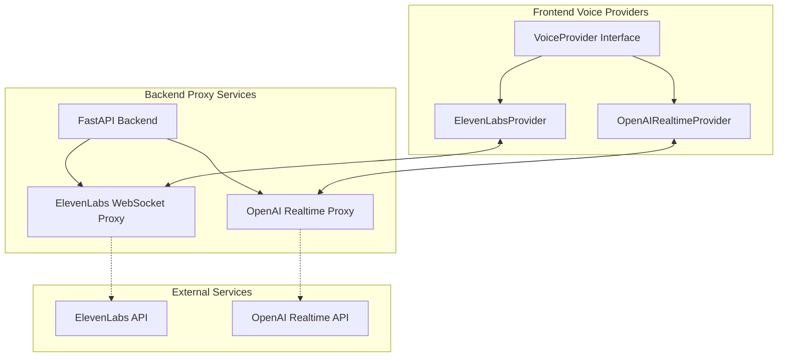

# OpenAI Realtime API Implementation Guide

## Overview
OpenAI's Realtime API (GA as of August 28, 2025) enables fast, low-latency voice conversations with GPT-4o using WebSocket connections. This document provides comprehensive implementation details using official SDK documentation from `/openai/openai-realtime-api-beta` and `/azure-samples/aoai-realtime-audio-sdk`.

## Architecture Integration with Existing System

### Modular Voice Provider Pattern
The system uses a modular provider architecture that allows multiple voice providers to coexist. OpenAI Realtime API can be integrated alongside the existing ElevenLabs implementation.



### Provider Factory Pattern
Similar to the existing `MarketServiceFactory` for data services, implement a voice provider factory:

```typescript
// frontend/src/providers/VoiceProviderFactory.ts
export class VoiceProviderFactory {
  static createProvider(type: 'elevenlabs' | 'openai', config: any) {
    switch(type) {
      case 'elevenlabs':
        return new ElevenLabsProvider(config);
      case 'openai':
        return new OpenAIRealtimeProvider(config);
      default:
        throw new Error(`Unknown provider type: ${type}`);
    }
  }
}
```

### Integration Points
1. **Backend Proxy Endpoints**:
   - Existing: `/elevenlabs/signed-url` - Returns signed WebSocket URL
   - New: `/openai/realtime` - WebSocket proxy for OpenAI Realtime API

2. **Frontend Provider Interface**:
   - Both providers implement same interface for seamless switching
   - Common methods: `connect()`, `sendAudio()`, `disconnect()`, event handlers

3. **Environment Configuration**:
   - Hybrid approach using `USE_VOICE_PROVIDER` environment variable
   - Maintains backward compatibility with ElevenLabs as default

## Video Analysis Results (YouTube: nfBbmtMJhX0)

### What the Official OpenAI Video Actually Shows
Based on TwelveLabs AI analysis of the official OpenAI Realtime API video:

1. **Product Demo Focus**: The video is a product demonstration, not a technical implementation tutorial
2. **No Code Examples**: No WebSocket URLs, authentication code, or implementation details were shown
3. **Capabilities Demonstrated**:
   - **GPT Real-Time Speech Model**: Natural voice interactions with emotional range
   - **Language Switching**: Seamless switching between English, Spanish, and Japanese
   - **Instruction Following**: Adherence to specific guidelines (e.g., refund policies)
   - **Image Input**: New capability to process and describe images in conversation
   - **Real-World Demo**: T-Mobile customer service scenario for phone upgrades

## Official SDK Implementation

### Installation

```bash
# OpenAI Realtime API Beta Client
$ npm i openai/openai-realtime-api-beta --save

# Azure OpenAI SDK (.NET)
Install-Package OpenAI.Audio -Version 2.1.0-beta.1
```

### WebSocket Connection Details

#### OpenAI Direct Connection
```javascript
// Endpoint for OpenAI
const OPENAI_REALTIME_URL = 'wss://api.openai.com/v1/realtime';
```

#### Azure OpenAI Connection
```http
wss://my-eastus2-openai-resource.openai.azure.com/openai/realtime?api-version=2024-10-01-preview&deployment=gpt-4o-realtime-preview-1001
```

### Authentication Methods

#### 1. OpenAI API Key Authentication (Node.js)
```javascript
import { RealtimeClient } from '@openai/realtime-api-beta';

const client = new RealtimeClient({ 
  apiKey: process.env.OPENAI_API_KEY 
});

// Browser usage (not recommended for production)
const client = new RealtimeClient({
  apiKey: process.env.OPENAI_API_KEY,
  dangerouslyAllowAPIKeyInBrowser: true,
});
```

#### 2. Azure OpenAI Authentication Options
```csharp
// Option 1: API Key Authentication
var client = new AzureOpenAIClient(
    Environment.GetEnvironmentVariable("AZURE_OPENAI_ENDPOINT"),
    new AzureKeyCredential(Environment.GetEnvironmentVariable("AZURE_OPENAI_API_KEY")));

// Option 2: Entra ID Authentication (Recommended)
var client = new AzureOpenAIClient(
    new Uri(Environment.GetEnvironmentVariable("AZURE_OPENAI_ENDPOINT")),
    new DefaultAzureCredential());

var realtimeClient = client.GetRealtimeConversationClient();
```

#### 3. Backend Proxy Pattern (Recommended for Production)
```javascript
// Connect to your relay server instead of directly to OpenAI
const client = new RealtimeClient({ 
  url: RELAY_SERVER_URL 
});
```

### Core Client Implementation

#### Initialize and Configure Session
```javascript
import { RealtimeClient } from '@openai/realtime-api-beta';

const client = new RealtimeClient({ apiKey: process.env.OPENAI_API_KEY });

// Configure session parameters before connecting
client.updateSession({ 
  instructions: 'You are a great, upbeat friend.',
  voice: 'alloy',
  turn_detection: { type: 'server_vad' }, // or 'none' for manual control
  input_audio_transcription: { model: 'whisper-1' },
  input_audio_format: 'pcm16',
  output_audio_format: 'pcm16',
  temperature: 0.7,
  modalities: ['text', 'audio'],
  tools: [] // Function definitions go here
});

// Connect to Realtime API
await client.connect();

// Send initial message
client.sendUserMessageContent([
  { type: 'input_text', text: 'How are you?' }
]);
```

### Audio Implementation

#### Audio Format Specifications
- **Format**: PCM 16-bit
- **Sample Rate**: 24,000 Hz (24kHz)
- **Channels**: Mono (1 channel)
- **Encoding**: Base64 for JSON transport or raw binary for WebSocket frames

#### Sending Audio Data
```javascript
// Send streaming audio data - must be Int16Array or ArrayBuffer
// This example generates 1 second of audio in 0.1s chunks
for (let i = 0; i < 10; i++) {
  const data = new Int16Array(2400); // 0.1s at 24kHz
  for (let n = 0; n < 2400; n++) {
    const value = Math.floor((Math.random() * 2 - 1) * 0x8000);
    data[n] = value;
  }
  client.appendInputAudio(data);
}

// Commit audio and trigger response (when turn_detection is 'none')
client.createResponse();
```

#### Audio Buffer Management for Azure
```csharp
// Send audio from file stream
using Stream audioInputStream = File.OpenRead("audio_hello_world.wav");
await session.SendInputAudioAsync(audioInputStream);

// Or send as binary data
var audioData = BinaryData.FromBytes(File.ReadAllBytes("audio.wav"));
await session.SendInputAudioAsync(audioData);
```

## Implementation Path for System Integration

### Step 1: Create OpenAIRealtimeProvider
Based on the existing ElevenLabsProvider pattern:

```typescript
// frontend/src/providers/OpenAIRealtimeProvider.ts
export class OpenAIRealtimeProvider implements VoiceProvider {
  private client: RealtimeClient | null = null;
  private ws: WebSocket | null = null;
  
  constructor(private config: {
    apiUrl: string;      // Backend proxy URL
    model?: string;      // 'gpt-4o-realtime' or custom
    voice?: string;      // 'alloy', 'echo', 'fable', etc.
  }) {}
  
  async connect(): Promise<void> {
    // Get proxy WebSocket URL from backend
    const response = await fetch(`${this.config.apiUrl}/openai/realtime/session`, {
      method: 'POST',
      headers: { 'Content-Type': 'application/json' },
      body: JSON.stringify({
        model: this.config.model || 'gpt-4o-realtime',
        voice: this.config.voice || 'alloy'
      })
    });
    
    const { wsUrl, sessionId } = await response.json();
    
    // Connect to backend proxy (not directly to OpenAI)
    this.ws = new WebSocket(wsUrl);
    
    // Initialize RealtimeClient with WebSocket
    this.client = new RealtimeClient({ url: wsUrl });
    await this.client.connect();
  }
  
  async sendAudio(audioData: ArrayBuffer): Promise<void> {
    if (!this.client) throw new Error('Not connected');
    
    // Convert to PCM16 24kHz if needed
    const pcmData = this.convertToPCM16(audioData);
    this.client.appendInputAudio(pcmData);
  }
  
  onTranscript(callback: (text: string) => void): void {
    this.client?.on('conversation.item.input_audio_transcription.completed', 
      ({ transcript }) => callback(transcript));
  }
  
  onAudioResponse(callback: (audio: ArrayBuffer) => void): void {
    this.client?.on('response.audio.delta', 
      ({ delta }) => callback(delta));
  }
}
```

### Step 2: Backend Proxy Implementation
Add to existing FastAPI backend:

```python
# backend/mcp_server.py
from fastapi import WebSocket, WebSocketDisconnect
import websockets
import os

@app.websocket("/openai/realtime/{session_id}")
async def openai_realtime_proxy(websocket: WebSocket, session_id: str):
    """
    Proxy WebSocket connection to OpenAI Realtime API.
    Follows same pattern as ElevenLabs proxy.
    """
    await websocket.accept()
    
    # Construct OpenAI WebSocket URL with auth
    openai_url = "wss://api.openai.com/v1/realtime"
    headers = {
        "Authorization": f"Bearer {os.getenv('OPENAI_API_KEY')}",
        "OpenAI-Beta": "realtime=v1"
    }
    
    try:
        async with websockets.connect(openai_url, additional_headers=headers) as openai_ws:
            # Bidirectional message relay (same pattern as ElevenLabs)
            async def relay_to_openai():
                async for message in websocket.iter_text():
                    await openai_ws.send(message)
            
            async def relay_from_openai():
                async for message in openai_ws:
                    await websocket.send_text(message)
            
            await asyncio.gather(
                relay_to_openai(),
                relay_from_openai()
            )
    except WebSocketDisconnect:
        print(f"Client disconnected from session {session_id}")
    except Exception as e:
        print(f"Error in OpenAI proxy: {e}")
        await websocket.close(code=1011, reason=str(e))

@app.post("/openai/realtime/session")
async def create_openai_session(request: dict):
    """
    Create a new OpenAI Realtime session.
    Returns WebSocket URL for client connection.
    """
    session_id = str(uuid.uuid4())
    ws_url = f"ws://localhost:8000/openai/realtime/{session_id}"
    
    # Store session config if needed
    # sessions[session_id] = request
    
    return {
        "wsUrl": ws_url,
        "sessionId": session_id,
        "model": request.get("model", "gpt-4o-realtime"),
        "voice": request.get("voice", "alloy")
    }
```

### Step 3: Environment Configuration
Update backend environment variables:

```bash
# backend/.env
# Existing ElevenLabs config
ELEVENLABS_API_KEY=your_elevenlabs_key
ELEVENLABS_AGENT_ID=your_agent_id

# New OpenAI Realtime config
OPENAI_API_KEY=sk-...
OPENAI_REALTIME_MODEL=gpt-4o-realtime-preview
OPENAI_DEFAULT_VOICE=alloy

# Voice provider selection
USE_VOICE_PROVIDER=elevenlabs  # or 'openai' or 'both'
```

### Step 4: Frontend Integration
Update the main application to support provider switching:

```typescript
// frontend/src/App.tsx
import { VoiceProviderFactory } from './providers/VoiceProviderFactory';

function App() {
  const [voiceProvider, setVoiceProvider] = useState<'elevenlabs' | 'openai'>('elevenlabs');
  
  const initializeVoice = () => {
    const config = voiceProvider === 'elevenlabs' 
      ? { 
          agentId: import.meta.env.VITE_ELEVENLABS_AGENT_ID,
          apiUrl: import.meta.env.VITE_API_URL 
        }
      : { 
          apiUrl: import.meta.env.VITE_API_URL,
          model: 'gpt-4o-realtime',
          voice: 'alloy'
        };
    
    const provider = VoiceProviderFactory.createProvider(voiceProvider, config);
    return provider;
  };
  
  // UI for switching providers
  return (
    <div>
      <select onChange={(e) => setVoiceProvider(e.target.value as any)}>
        <option value="elevenlabs">ElevenLabs</option>
        <option value="openai">OpenAI Realtime</option>
      </select>
      {/* Rest of app */}
    </div>
  );
}
```

### Event Handling

#### Core Utility Events (Simplified API)
```javascript
// Connection and error handling
client.on('error', (event) => {
  console.error('Connection error:', event);
});

// User interruption detection (VAD mode)
client.on('conversation.interrupted', () => {
  // Stop current audio playback
  audioPlayer.stop();
});

// Main conversation update handler
client.on('conversation.updated', ({ item, delta }) => {
  const items = client.conversation.getItems();
  
  switch (item.type) {
    case 'message':
      // Handle system, user, or assistant messages
      console.log(`${item.role}: ${item.content}`);
      break;
      
    case 'function_call':
      // Handle function calls from the model
      console.log(`Function: ${item.name}(${item.arguments})`);
      break;
      
    case 'function_call_output':
      // Handle function responses
      console.log(`Function result: ${item.output}`);
      break;
  }
  
  // Handle incremental updates
  if (delta) {
    if (delta.audio) {
      // Int16Array audio chunk received
      audioPlayer.appendAudio(delta.audio);
    }
    if (delta.transcript) {
      // Partial transcript update
      updateTranscript(delta.transcript);
    }
    if (delta.arguments) {
      // Function arguments being streamed
      updateFunctionArgs(delta.arguments);
    }
  }
});

// Item lifecycle events
client.on('conversation.item.appended', ({ item }) => {
  console.log('New item added:', item.id);
});

client.on('conversation.item.completed', ({ item }) => {
  console.log('Item completed:', item.id);
});
```

#### Raw Event Access (Advanced)
```javascript
// Access all raw WebSocket events for debugging or custom handling
client.on('realtime.event', ({ time, source, event }) => {
  // time: ISO timestamp
  // source: 'client' or 'server'
  // event: raw JSON payload
  
  if (source === 'server') {
    console.log(`Server event at ${time}:`, event.type);
    
    // Handle specific server events
    switch (event.type) {
      case 'response.audio.delta':
        // Raw audio delta handling
        break;
      case 'response.function_call_arguments.done':
        // Function call complete
        break;
      case 'input_audio_buffer.speech_started':
        // VAD detected speech start
        break;
      case 'input_audio_buffer.speech_stopped':
        // VAD detected speech end
        break;
    }
  }
});
```

### Tool/Function Calling

#### Method 1: Automatic Callback Handling
```javascript
// Add tool with automatic execution and response
client.addTool(
  {
    name: 'get_weather',
    description: 'Retrieves the weather for a given lat, lng coordinate pair. Specify a label for the location.',
    parameters: {
      type: 'object',
      properties: {
        lat: {
          type: 'number',
          description: 'Latitude',
        },
        lng: {
          type: 'number',
          description: 'Longitude',
        },
        location: {
          type: 'string',
          description: 'Name of the location',
        },
      },
      required: ['lat', 'lng', 'location'],
    },
  },
  async ({ lat, lng, location }) => {
    // Tool implementation - return value is automatically sent back
    const result = await fetch(
      `https://api.open-meteo.com/v1/forecast?latitude=${lat}&longitude=${lng}&current=temperature_2m,wind_speed_10m`
    );
    const json = await result.json();
    return json;
  }
);
```

#### Method 2: Manual Tool Definition
```javascript
// Define tools in session configuration
client.updateSession({
  tools: [
    {
      type: 'function',
      name: 'get_weather',
      description: 'Retrieves the weather for a given lat, lng coordinate pair.',
      parameters: {
        type: 'object',
        properties: {
          lat: { type: 'number', description: 'Latitude' },
          lng: { type: 'number', description: 'Longitude' },
          location: { type: 'string', description: 'Name of the location' }
        },
        required: ['lat', 'lng', 'location']
      }
    }
  ]
});

// Handle function calls manually
client.on('conversation.item.completed', ({ item }) => {
  if (item.type === 'function_call') {
    // Execute function and send response
    const result = executeFunction(item.name, item.arguments);
    
    // Send function output back
    client.realtime.send('conversation.item.create', {
      item: {
        type: 'function_call_output',
        call_id: item.call_id,
        output: JSON.stringify(result),
      }
    });
    
    // Trigger model to continue
    client.realtime.send('response.create');
  }
});
```

### Advanced Features

#### Manual Response Control
```javascript
// Cancel in-progress response
client.cancelResponse(responseId, sampleCount);

// Manually trigger response (when turn_detection is 'none')
client.createResponse();

// Send custom events
client.realtime.send('conversation.item.create', {
  item: {
    type: 'message',
    role: 'user',
    content: [{ type: 'input_text', text: 'Custom message' }]
  }
});
```

#### Session Management
```javascript
// Access conversation history
const items = client.conversation.getItems();

// Clear conversation
client.conversation.clear();

// Update session mid-conversation
client.updateSession({
  temperature: 0.5,
  instructions: 'Be more concise in your responses'
});
```

### Backend Implementation Examples

#### Node.js/Express WebSocket Proxy
```javascript
const WebSocket = require('ws');
const express = require('express');
const app = express();

app.ws('/openai/realtime', async (ws, req) => {
  // Create connection to OpenAI
  const openaiWs = new WebSocket('wss://api.openai.com/v1/realtime', {
    headers: {
      'Authorization': `Bearer ${process.env.OPENAI_API_KEY}`,
      'OpenAI-Beta': 'realtime=v1'
    }
  });

  // Relay messages bidirectionally
  openaiWs.on('open', () => {
    ws.on('message', (data) => {
      openaiWs.send(data);
    });

    openaiWs.on('message', (data) => {
      ws.send(data);
    });
  });

  // Handle disconnections
  ws.on('close', () => openaiWs.close());
  openaiWs.on('close', () => ws.close());
});
```

#### Python/FastAPI WebSocket Proxy
```python
from fastapi import FastAPI, WebSocket
import websockets
import asyncio
import json

app = FastAPI()

@app.websocket("/openai/realtime")
async def openai_realtime_proxy(websocket: WebSocket):
    await websocket.accept()
    
    # Connect to OpenAI
    headers = {
        "Authorization": f"Bearer {os.getenv('OPENAI_API_KEY')}",
        "OpenAI-Beta": "realtime=v1"
    }
    
    async with websockets.connect(
        "wss://api.openai.com/v1/realtime",
        additional_headers=headers
    ) as openai_ws:
        
        # Bidirectional message relay
        async def relay_to_openai():
            async for message in websocket.iter_text():
                await openai_ws.send(message)
        
        async def relay_to_client():
            async for message in openai_ws:
                await websocket.send_text(message)
        
        # Run both relay tasks concurrently
        await asyncio.gather(
            relay_to_openai(),
            relay_to_client()
        )
```

### Integration with Existing Architecture

#### Leveraging the Hybrid Service Pattern
The existing system uses a hybrid MCP/Direct API pattern that can be adapted for voice providers:

```python
# backend/services/voice_service_factory.py
# Based on existing market_service_factory.py pattern
import os
from typing import Union

class VoiceServiceFactory:
    @staticmethod
    def create_voice_service() -> Union[ElevenLabsService, OpenAIRealtimeService]:
        """
        Factory method to create appropriate voice service based on environment.
        Follows same pattern as MarketServiceFactory.
        """
        provider = os.getenv('USE_VOICE_PROVIDER', 'elevenlabs').lower()
        
        if provider == 'openai':
            from services.openai_realtime_service import OpenAIRealtimeService
            return OpenAIRealtimeService()
        elif provider == 'both':
            # Return a composite service that can switch between providers
            from services.composite_voice_service import CompositeVoiceService
            return CompositeVoiceService()
        else:
            from services.elevenlabs_service import ElevenLabsService
            return ElevenLabsService()
```

#### Adapting the Existing WebSocket Proxy Pattern
The current ElevenLabs implementation provides a template:

```python
# backend/mcp_server.py - Existing ElevenLabs pattern
@app.get("/elevenlabs/signed-url")
async def get_elevenlabs_signed_url():
    """Current ElevenLabs implementation returns a signed URL."""
    agent_id = os.getenv("ELEVENLABS_AGENT_ID")
    api_key = os.getenv("ELEVENLABS_API_KEY")
    
    # Get signed URL from ElevenLabs
    url = f"https://api.elevenlabs.io/v1/convai/conversation"
    headers = {"xi-api-key": api_key}
    params = {"agent_id": agent_id}
    
    async with httpx.AsyncClient() as client:
        response = await client.get(url, headers=headers, params=params)
        data = response.json()
        return {"signedUrl": data["signed_url"]}

# Adapt for OpenAI Realtime - proxy pattern instead of signed URL
@app.websocket("/openai/realtime")
async def openai_realtime_websocket(websocket: WebSocket):
    """
    OpenAI requires proxy pattern instead of signed URL.
    Follows WebSocket relay pattern.
    """
    await websocket.accept()
    voice_service = VoiceServiceFactory.create_voice_service()
    
    if isinstance(voice_service, OpenAIRealtimeService):
        await voice_service.handle_websocket_proxy(websocket)
```

#### Frontend Provider Pattern from Existing Code
The modular provider system shown in mermaid.md:

```typescript
// frontend/src/providers/BaseVoiceProvider.ts
// Abstract base class following existing pattern
export abstract class BaseVoiceProvider {
  protected ws: WebSocket | null = null;
  protected isConnected: boolean = false;
  
  abstract connect(): Promise<void>;
  abstract disconnect(): void;
  abstract sendAudio(data: ArrayBuffer): void;
  abstract onTranscript(callback: (text: string) => void): void;
  abstract onAudioResponse(callback: (audio: ArrayBuffer) => void): void;
  
  // Common functionality shared between providers
  protected handleReconnection(): void {
    console.log('Attempting to reconnect...');
    setTimeout(() => this.connect(), 1000);
  }
}

// frontend/src/providers/ElevenLabsProvider.ts (existing)
export class ElevenLabsProvider extends BaseVoiceProvider {
  constructor(private config: { agentId: string; apiUrl: string }) {
    super();
  }
  
  async connect(): Promise<void> {
    // Get signed URL from backend
    const response = await fetch(`${this.config.apiUrl}/elevenlabs/signed-url`);
    const { signedUrl } = await response.json();
    
    // Connect directly to ElevenLabs
    this.ws = new WebSocket(signedUrl);
    // ... rest of implementation
  }
}

// frontend/src/providers/OpenAIRealtimeProvider.ts (new)
export class OpenAIRealtimeProvider extends BaseVoiceProvider {
  private client: RealtimeClient | null = null;
  
  constructor(private config: { apiUrl: string; model?: string; voice?: string }) {
    super();
  }
  
  async connect(): Promise<void> {
    // Create session and get proxy URL
    const response = await fetch(`${this.config.apiUrl}/openai/realtime/session`, {
      method: 'POST',
      headers: { 'Content-Type': 'application/json' },
      body: JSON.stringify({
        model: this.config.model || 'gpt-4o-realtime',
        voice: this.config.voice || 'alloy'
      })
    });
    
    const { wsUrl } = await response.json();
    
    // Connect through backend proxy
    this.client = new RealtimeClient({ url: wsUrl });
    await this.client.connect();
    // ... rest of implementation
  }
}
```

#### Environment-Based Configuration (from claude.md)
The existing hybrid approach for market data can be applied to voice:

```typescript
// frontend/src/hooks/useVoiceProvider.ts
export const useVoiceProvider = () => {
  const [provider, setProvider] = useState<BaseVoiceProvider | null>(null);
  
  useEffect(() => {
    // Check environment or user preference
    const providerType = localStorage.getItem('voice_provider') || 
                        import.meta.env.VITE_DEFAULT_VOICE_PROVIDER || 
                        'elevenlabs';
    
    const config = providerType === 'elevenlabs'
      ? {
          agentId: import.meta.env.VITE_ELEVENLABS_AGENT_ID,
          apiUrl: import.meta.env.VITE_API_URL
        }
      : {
          apiUrl: import.meta.env.VITE_API_URL,
          model: 'gpt-4o-realtime',
          voice: 'alloy'
        };
    
    const voiceProvider = VoiceProviderFactory.createProvider(providerType, config);
    setProvider(voiceProvider);
    
    return () => {
      voiceProvider.disconnect();
    };
  }, []);
  
  return provider;
};
```

### Testing & Debugging

#### Enable Debug Logging
```bash
# Run tests with debug output
$ npm test -- --debug
```

#### Debug Event Logger
```javascript
// Log all events for debugging
client.on('realtime.event', ({ time, source, event }) => {
  console.log(`[${time}] ${source} -> ${event.type}`, event);
});

// Track connection state
client.on('connect', () => console.log('Connected to Realtime API'));
client.on('disconnect', () => console.log('Disconnected from Realtime API'));
```

#### Common Issues & Solutions

1. **Audio Format Issues**
```javascript
// Ensure correct audio format
const audioFormat = {
  sampleRate: 24000,  // Must be 24kHz
  channels: 1,         // Must be mono
  bitDepth: 16        // Must be 16-bit PCM
};
```

2. **Turn Detection Configuration**
```javascript
// For audio files or manual control
client.updateSession({ 
  turn_detection: { type: 'none' } 
});

// For live conversation
client.updateSession({ 
  turn_detection: { 
    type: 'server_vad',
    threshold: 0.5,
    prefix_padding_ms: 300,
    silence_duration_ms: 500
  } 
});
```

3. **Rate Limiting**
```javascript
client.on('realtime.event', ({ event }) => {
  if (event.type === 'rate_limits.updated') {
    console.log('Rate limits:', event.rate_limits);
  }
});
```

### Performance Optimization

#### Latency Benchmarks
- **Time to First Byte**: ~500ms (US-based clients)
- **Voice-to-Voice Target**: <800ms total latency
- **Audio Chunk Size**: 2400 samples (100ms) recommended

#### Connection Optimization
```javascript
// Implement reconnection logic
let reconnectAttempts = 0;
const maxReconnectAttempts = 5;

client.on('disconnect', async () => {
  if (reconnectAttempts < maxReconnectAttempts) {
    reconnectAttempts++;
    console.log(`Reconnecting... (attempt ${reconnectAttempts})`);
    await new Promise(resolve => setTimeout(resolve, 1000 * reconnectAttempts));
    await client.connect();
  }
});

client.on('connect', () => {
  reconnectAttempts = 0;
});
```

### Cost Management

#### Usage Tracking
```javascript
let sessionCost = {
  inputSeconds: 0,
  outputSeconds: 0,
  estimatedCost: 0
};

client.on('conversation.updated', ({ item, delta }) => {
  if (delta?.audio) {
    // Track audio duration (samples / sampleRate)
    const seconds = delta.audio.length / 24000;
    
    if (item.role === 'user') {
      sessionCost.inputSeconds += seconds;
    } else {
      sessionCost.outputSeconds += seconds;
    }
    
    // Calculate cost ($0.06/min input, $0.24/min output)
    sessionCost.estimatedCost = 
      (sessionCost.inputSeconds / 60) * 0.06 + 
      (sessionCost.outputSeconds / 60) * 0.24;
  }
});
```

#### Cost Optimization Strategies
1. **Implement Session Timeouts**
```javascript
const SESSION_TIMEOUT = 5 * 60 * 1000; // 5 minutes
let sessionTimer;

client.on('conversation.updated', () => {
  clearTimeout(sessionTimer);
  sessionTimer = setTimeout(() => {
    client.disconnect();
    console.log('Session timeout - disconnecting to save costs');
  }, SESSION_TIMEOUT);
});
```

2. **Use Text Mode for Non-Critical Interactions**
```javascript
// Switch to text-only mode when appropriate
client.updateSession({ 
  modalities: ['text'] // Removes audio processing
});
```

## Production Architecture

### Recommended Architecture
```
┌─────────────┐     ┌──────────────┐     ┌─────────────┐
│   Browser   │────▶│  Your Backend │────▶│   OpenAI    │
│  (WebRTC)   │◀────│   (Relay)     │◀────│  Realtime   │
└─────────────┘     └──────────────┘     └─────────────┘
```

### Security Best Practices
1. **Never expose API keys to frontend**
2. **Implement authentication on relay server**
3. **Add rate limiting per user**
4. **Monitor for abuse patterns**
5. **Use HTTPS/WSS for all connections**

### Monitoring & Observability
```javascript
// Track key metrics
const metrics = {
  connectionUptime: 0,
  messagesProcessed: 0,
  errorsEncountered: 0,
  averageLatency: 0
};

// Monitor connection health
setInterval(() => {
  console.log('Connection metrics:', metrics);
  // Send to monitoring service
}, 60000);
```

## Comparison with ElevenLabs

### Feature Comparison
| Feature | ElevenLabs | OpenAI Realtime |
|---------|------------|-----------------|
| **Latency** | ~1-2s | ~500ms |
| **Voice Quality** | Excellent | Good |
| **Custom Voices** | Yes | No (6 presets: alloy, echo, fable, onyx, nova, shimmer) |
| **Cost** | ~$0.30/min | ~$0.30/min |
| **Function Calling** | Via agent config | Native support |
| **VAD** | Built-in | Built-in (server_vad) |
| **Languages** | 29+ | Multiple |
| **WebSocket** | Direct (signed URL) | Needs proxy |
| **Audio Format** | PCM 16kHz | PCM 24kHz |

### Architecture Integration Comparison
| Aspect | ElevenLabs | OpenAI Realtime |
|---------|------------|-----------------|
| **Provider Config** | Requires `agentId` | Requires `apiKey` |
| **Backend Proxy** | `/elevenlabs/signed-url` returns URL | `/openai/realtime` WebSocket proxy |
| **Connection Pattern** | Direct WebSocket to ElevenLabs | Proxied through backend |
| **Session Management** | Agent-based | Session-based with ID |
| **Frontend Integration** | `ElevenLabsProvider` class | `OpenAIRealtimeProvider` class |
| **Environment Variables** | `ELEVENLABS_API_KEY`, `ELEVENLABS_AGENT_ID` | `OPENAI_API_KEY`, `OPENAI_REALTIME_MODEL` |
| **Audio Processing** | 16kHz mono PCM | 24kHz mono PCM |
| **Event Handling** | Custom event system | RealtimeClient event emitter |
| **Integration Complexity** | Low (signed URL) | Medium (proxy setup) |
| **Production Considerations** | Direct connection | Requires secure proxy |

## Migration Guide: Adding OpenAI Realtime to Existing System

### Phase 1: Backend Preparation
1. **Add OpenAI API Key**
   ```bash
   # backend/.env
   OPENAI_API_KEY=sk-...
   ```

2. **Implement Proxy Endpoint**
   - Copy pattern from existing ElevenLabs proxy
   - Add to `backend/mcp_server.py`:
   ```python
   @app.websocket("/openai/realtime/{session_id}")
   async def openai_realtime_proxy(websocket: WebSocket, session_id: str):
       # Implementation from Step 2 above
   ```

3. **Test Backend Connection**
   ```bash
   curl -X POST http://localhost:8000/openai/realtime/session \
     -H "Content-Type: application/json" \
     -d '{"model": "gpt-4o-realtime", "voice": "alloy"}'
   ```

### Phase 2: Frontend Provider Implementation
1. **Create Provider Class**
   ```bash
   cp frontend/src/providers/ElevenLabsProvider.ts \
      frontend/src/providers/OpenAIRealtimeProvider.ts
   # Modify to use RealtimeClient from OpenAI SDK
   ```

2. **Install OpenAI SDK**
   ```bash
   cd frontend
   npm install @openai/realtime-api-beta
   ```

3. **Update Provider Factory**
   ```typescript
   // frontend/src/providers/VoiceProviderFactory.ts
   import { OpenAIRealtimeProvider } from './OpenAIRealtimeProvider';
   
   export class VoiceProviderFactory {
     static createProvider(type: string, config: any) {
       // Add OpenAI case
     }
   }
   ```

### Phase 3: Parallel Testing
1. **Enable Both Providers**
   ```bash
   # backend/.env
   USE_VOICE_PROVIDER=both
   ```

2. **Add Provider Toggle UI**
   ```typescript
   // frontend/src/components/VoiceSettings.tsx
   <ToggleGroup>
     <Toggle value="elevenlabs">ElevenLabs</Toggle>
     <Toggle value="openai">OpenAI Realtime</Toggle>
   </ToggleGroup>
   ```

3. **A/B Testing Setup**
   - Log performance metrics for both providers
   - Track user preference and success rates
   - Monitor cost per session

### Phase 4: Production Rollout
1. **Gradual Migration**
   ```typescript
   // Use feature flags for controlled rollout
   const provider = featureFlags.useOpenAI && Math.random() > 0.5 
     ? 'openai' 
     : 'elevenlabs';
   ```

2. **Monitor Key Metrics**
   - Latency: Target < 800ms voice-to-voice
   - Success rate: WebSocket connection stability
   - Cost: Track per-minute usage
   - User satisfaction: Completion rates

3. **Fallback Strategy**
   ```typescript
   try {
     await openAIProvider.connect();
   } catch (error) {
     console.warn('OpenAI connection failed, falling back to ElevenLabs');
     await elevenLabsProvider.connect();
   }
   ```

### Phase 5: Optimization
1. **Connection Pooling**
   - Reuse WebSocket connections where possible
   - Implement connection health checks

2. **Audio Pipeline Optimization**
   ```typescript
   // Optimize audio conversion for 24kHz
   class AudioProcessor {
     convertTo24kHz(input16kHz: ArrayBuffer): ArrayBuffer {
       // Upsampling implementation
     }
   }
   ```

3. **Cost Management**
   - Implement session timeouts
   - Add usage quotas per user
   - Monitor and alert on unusual usage patterns

### Common Migration Issues & Solutions

#### Issue 1: Audio Format Mismatch
**Problem**: ElevenLabs uses 16kHz, OpenAI uses 24kHz
**Solution**: 
```typescript
// Add audio resampling in provider
const resample = (buffer: ArrayBuffer, fromRate: number, toRate: number) => {
  // Resampling logic
};
```

#### Issue 2: Different Event Structures
**Problem**: Event names and payloads differ between providers
**Solution**: 
```typescript
// Normalize events in provider classes
interface UnifiedVoiceEvent {
  type: 'transcript' | 'audio' | 'error';
  data: any;
}
```

#### Issue 3: Session Management Differences
**Problem**: ElevenLabs uses agent IDs, OpenAI uses session IDs
**Solution**: 
```typescript
// Abstract session management
interface VoiceSession {
  id: string;
  provider: 'elevenlabs' | 'openai';
  config: any;
}
```

### Testing Checklist
- [ ] Backend proxy endpoint responds correctly
- [ ] WebSocket connection establishes successfully
- [ ] Audio streams bidirectionally
- [ ] Transcription events fire correctly
- [ ] Function calling works (if applicable)
- [ ] Error handling and reconnection logic works
- [ ] Provider switching works seamlessly
- [ ] Performance meets latency targets
- [ ] Cost tracking is accurate
- [ ] Fallback mechanism engages when needed

## Implementation Checklist

### Backend Tasks
- [ ] Set up WebSocket proxy endpoint
- [ ] Implement authentication middleware  
- [ ] Add connection pooling for multiple users
- [ ] Implement error handling and reconnection
- [ ] Add monitoring and logging
- [ ] Set up rate limiting

### Frontend Tasks
- [ ] Create OpenAIRealtimeProvider class
- [ ] Implement audio capture (24kHz PCM)
- [ ] Add audio playback queue
- [ ] Handle connection lifecycle
- [ ] Implement UI feedback for connection state
- [ ] Add cost tracking display

### Testing Tasks
- [ ] Test audio quality at different bitrates
- [ ] Measure end-to-end latency
- [ ] Test interruption handling
- [ ] Verify function calling
- [ ] Load test concurrent connections
- [ ] Test reconnection scenarios

## Resources

### Official Documentation
- [OpenAI Realtime API Beta SDK](https://github.com/openai/openai-realtime-api-beta)
- [Azure OpenAI Realtime Audio SDK](https://github.com/azure-samples/aoai-realtime-audio-sdk)
- [OpenAI Platform Docs](https://platform.openai.com/docs/guides/realtime)

### Community Resources
- [DataCamp Tutorial](https://www.datacamp.com/tutorial/realtime-api-openai)
- [Python FastAPI Implementation](https://medium.com/@sebasfernandezgar/how-to-use-openais-realtime-api-with-python-code-896ea5c23583)
- [Building Voice Apps with FastAPI](https://medium.com/thedeephub/building-a-voice-enabled-python-fastapi-app-using-openais-realtime-api-bfdf2947c3e4)

### Azure-Specific Resources
- [Azure OpenAI Realtime Docs](https://learn.microsoft.com/en-us/azure/ai-foundry/openai/how-to/realtime-audio-websockets)
- [Azure Samples Repository](https://github.com/azure-samples/aoai-realtime-audio-sdk)